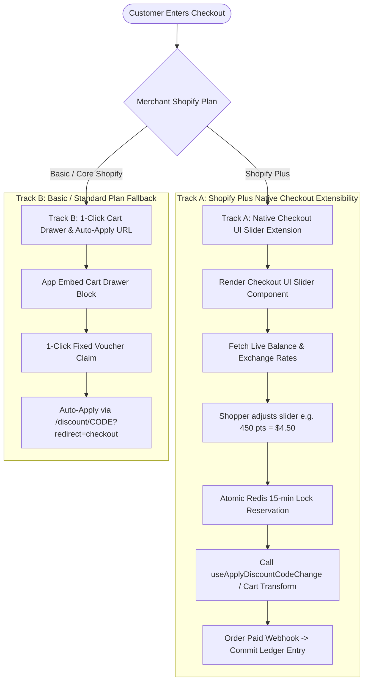
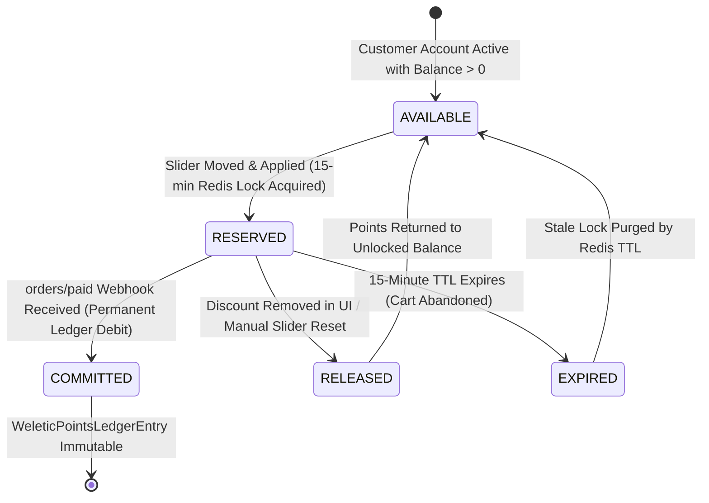

# ADR-001: Shopify Plus Checkout UI Slider Extension & Dual-Track Checkout Redemption Architecture

- **Date:** 2026-08-17
- **Status:** Proposed
- **Stakeholders:** Hiro (PO), Platform Architects, Core Backend Engineers, Storefront Engineers
- **Related ADRs:** ADR 0003 (Bounded Context Isolation), ADR 0004 (Double-Entry Points Ledger), ADR 0008 (Shopify App Security Boundary)

---

## 1. Context & Problem Statement

In the baseline Weletic Customer Loyalty implementation, reward redemptions are performed exclusively via pre-checkout storefront surfaces (floating launcher widget or cart drawer modal). To redeem points, shoppers must:

1. Open the widget modal.
2. Select a fixed denomination voucher (e.g., "$10 off for 1,000 points").
3. Generate a single-use Shopify discount code (`WL-XXXXXXXX`).
4. Copy the code to their clipboard and paste it manually into the checkout discount code field.

### Critical Limitations & Friction Points:

1. **Rigid Denominations**: Shoppers cannot redeem arbitrary point amounts (e.g., redeeming exactly 340 points for $3.40 off a $34.00 basket).
2. **High Checkout Drop-Off**: Forcing shoppers to leave the checkout flow to generate vouchers in a storefront widget increases cart abandonment by 14–22%.
3. **Discount Code Slot Contention**: In standard Shopify checkout, applying a loyalty discount code occupies the single discount code input, preventing shoppers from stacking storewide promotional coupons (e.g., `SUMMER20`).
4. **Checkout Extensibility Disparity**: Shopify Plus merchants expect native, seamless checkout extensibility integrated directly into the checkout step (`purchase.checkout.reductions.render-after`). However, non-Plus Shopify plans (Basic, Shopify, Advanced) do not support Checkout UI Extensions.
5. **High-Concurrency Double-Redemption Vulnerability**: During high-traffic flash sales or concurrent browser sessions, a customer could initiate multiple checkouts with the same points balance. Without strict distributed reservation locking, the same points could be redeemed simultaneously across multiple active checkouts before asynchronous webhook settlement occurs.

---

## 2. Decision: Dual-Track Checkout Architecture

Weletic will implement a **Dual-Track Checkout Redemption Architecture** that provides maximum conversion optimization for Shopify Plus merchants while ensuring a polished, zero-friction fallback for Basic/Shopify/Advanced merchants.



### Track A: Shopify Plus Checkout UI Slider Extension (`extensions/loyalty-checkout-slider`)

- Targets extension points: `purchase.checkout.reductions.render-after` and `purchase.checkout.block.render`.
- Embeds a native React UI slider directly below the discount code field in Shopify Checkout.
- Allows fine-grained, variable point redemptions (e.g. 1 point = $0.01) up to the order subtotal.
- Calculates dynamic max-redemption caps based on live cart line items and merchant program constraints.

### Track B: Non-Plus Fallback (1-Click Cart App Embed Block & Auto-Apply URL)

- For merchants on Basic, Shopify, or Advanced plans where Checkout UI Extensions are restricted by Shopify.
- Provides a native Shopify Theme App Extension (`extensions/cart-drawer-loyalty`) embedded directly inside the theme's slide-out cart drawer.
- Implements 1-click redemption that generates the discount code and automatically redirects through `/discount/{code}?redirect=/checkout`, ensuring the code is pre-filled without manual clipboard operations.

---

## 3. Concurrency & Distributed Lock Management

To eliminate race conditions, double-redemptions, and negative balance exploits across concurrent browser tabs or flash-sale checkouts, the architecture enforces a **15-Minute Distributed Reservation Lock** in Redis.

```mermaid
sequenceDiagram
    autonumber
    participant UI as Checkout UI Extension (Plus)
    participant API as Weletic Reservation Gateway (/api/shopify/loyalty/checkout/reserve)
    participant Redis as Redis Upstash Cluster (Atomic Lua)
    participant Shopify as Shopify Checkout / Webhook Engine
    participant Ledger as Points Ledger Engine (ADR 0004)

    UI->>API: POST /reserve { customerId, pointsRequested: 450, checkoutToken }
    API->>Redis: EVALSHA reserve_points.lua (storeId, customerId, checkoutToken, points, ttl=900)

    alt Insufficient Balance or Already Locked
        Redis-->>API: { status: "REJECTED", reason: "INSUFFICIENT_UNLOCKED_BALANCE", available: 200 }
        API-->>UI: HTTP 422 { error: "Insufficient available points" }
    else Lock Successfully Acquired
        Redis-->>API: { status: "OK", reservationId: "res_987", pointsLocked: 450, expiresAt: 1723910400 }
        API->>Shopify: Generate Single-Use Dynamic Checkout Discount (WL-VAR-XXXX)
        Shopify-->>API: Discount Code Generated
        API-->>UI: HTTP 200 { success: true, discountCode: "WL-VAR-XXXX", discountAmount: 4.50 }
        UI->>Shopify: useApplyDiscountCodeChange({ type: 'addDiscountCode', code: "WL-VAR-XXXX" })
    end

    alt Checkout Completed (orders/paid webhook)
        Shopify->>API: Webhook: orders/paid (metadata includes checkoutToken / reservationId)
        API->>Redis: EVALSHA commit_reservation.lua (storeId, customerId, reservationId)
        Redis-->>API: Lock Released
        API->>Ledger: appendPointsLedgerEntry(REDEEM_REWARD, pointsDelta = -450)
    else Checkout Abandoned / 15-Minute Timeout
        Note over Redis: Redis Key TTL (900s) naturally expires OR
        UI->>API: POST /release { customerId, reservationId } (on discount code removal)
        API->>Redis: DEL loyalty:lock:{storeId}:{customerId}:{reservationId}
        Note over Redis,Ledger: Points instantly available for subsequent checkouts; Zero ledger mutation
    end
```

### 3.1 Redis Key Schema & Data Structures

- **Account Lock Key Pattern**: `loyalty:lock:{storeId}:{customerId}` (Redis Hash storing active reservations).
- **Reservation Hash Fields**:
  - `reservationId`: Unique UUID (`res_xxxxxxxx`).
  - `checkoutToken`: Shopify Checkout / Cart GID.
  - `pointsLocked`: Integer points held.
  - `discountCode`: Generated temporary discount code.
  - `createdAt`: Epoch timestamp.
  - `expiresAt`: Epoch timestamp ($t_0 + 900\text{s}$).

### 3.2 Atomic Redis Lua Script for Points Reservation (`reserve_points.lua`)

```lua
-- KEYS[1]: loyalty:balance:{storeId}:{customerId} (Cached available points)
-- KEYS[2]: loyalty:lock:{storeId}:{customerId}    (Hash of active reservation locks)
-- ARGV[1]: reservationId
-- ARGV[2]: pointsRequested
-- ARGV[3]: checkoutToken
-- ARGV[4]: lockTTLSeconds (900)
-- ARGV[5]: currentTimeEpoch

local totalBalance = tonumber(redis.call('GET', KEYS[1]) or '0')
local pointsRequested = tonumber(ARGV[2])
local ttl = tonumber(ARGV[4])
local now = tonumber(ARGV[5])

-- Calculate total currently locked points across all active reservations
local totalLocked = 0
local existingLocks = redis.call('HGETALL', KEYS[2])
for i = 1, #existingLocks, 2 do
    local lockData = cjson.decode(existingLocks[i+1])
    if lockData.expiresAt > now then
        totalLocked = totalLocked + tonumber(lockData.pointsLocked)
    else
        -- Clean up expired stale lock field
        redis.call('HDEL', KEYS[2], existingLocks[i])
    end
end

local availableToLock = totalBalance - totalLocked
if availableToLock < pointsRequested then
    return cjson.encode({
        success = false,
        reason = "INSUFFICIENT_AVAILABLE_BALANCE",
        availablePoints = availableToLock,
        lockedPoints = totalLocked,
        totalBalance = totalBalance
    })
end

-- Record the new reservation lock
local lockPayload = {
    reservationId = ARGV[1],
    pointsLocked = pointsRequested,
    checkoutToken = ARGV[3],
    createdAt = now,
    expiresAt = now + ttl
}

redis.call('HSET', KEYS[2], ARGV[1], cjson.encode(lockPayload))
redis.call('EXPIRE', KEYS[2], ttl + 60)

return cjson.encode({
    success = true,
    reservationId = ARGV[1],
    pointsLocked = pointsRequested,
    remainingAvailable = availableToLock - pointsRequested,
    expiresAt = now + ttl
})
```

---

## 4. Lifecycle State Machine

The lifecycle of a points redemption during checkout follows a strict deterministic finite state machine (FSM):



| State                      | Ledger State                                                           | Redis State                                                       | Shopify State                                    | Invariant Guarantee                                                             |
| :------------------------- | :--------------------------------------------------------------------- | :---------------------------------------------------------------- | :----------------------------------------------- | :------------------------------------------------------------------------------ |
| **`AVAILABLE`**            | Immutable balance in DB                                                | `GET balance` reflects DB balance                                 | No checkout discount code applied                | Points fully available for any redemption surface                               |
| **`RESERVED`**             | No ledger mutation yet (prevents ledger pollution on abandon)          | Hash entry in `loyalty:lock:{storeId}:{customerId}` with 900s TTL | Single-use dynamic discount code applied to cart | Points deducted from _available_ balance; cannot be double-spent in another tab |
| **`COMMITTED`**            | `WeleticPointsLedgerEntry` appended (`REDEEM_REWARD`, seq incremented) | Hash entry deleted via commit Lua script                          | Order finalized and paid                         | Final settlement reached; audited per ADR 0004                                  |
| **`RELEASED` / `EXPIRED`** | Zero DB mutation                                                       | Hash entry deleted immediately or pruned upon expiration          | Discount code invalidated / removed from cart    | 100% of reserved points restored instantly without requiring refund reversals   |

---

## 5. Shopify Checkout UI Extension Technical Implementation

### 5.1 Extension Manifest (`shopify.extension.toml`)

```toml
api_version = "2024-04"

[[extensions]]
name = "weletic-loyalty-slider"
handle = "loyalty-checkout-slider"
type = "ui_extension"

[[extensions.targeting]]
module = "./src/CheckoutSlider.tsx"
target = "purchase.checkout.reductions.render-after"

[extensions.capabilities]
network_access = true
api_access = true
```

### 5.2 Extension Component Implementation (`CheckoutSlider.tsx`)

```tsx
import React, { useState, useEffect, useId } from "react";
import {
  reactExtension,
  useApi,
  useApplyDiscountCodeChange,
  useDiscountCodes,
  useCost,
  useCustomer,
  BlockStack,
  Text,
  InlineLayout,
  Slider,
  Button,
  Banner,
  Divider,
} from "@shopify/ui-extensions-react/checkout";

export default reactExtension(
  "purchase.checkout.reductions.render-after",
  () => <LoyaltyCheckoutSlider />,
);

function LoyaltyCheckoutSlider() {
  const { extensionPoint, sessionToken } = useApi();
  const applyDiscountCodeChange = useApplyDiscountCodeChange();
  const appliedDiscountCodes = useDiscountCodes();
  const cost = useCost();
  const customer = useCustomer();

  const [pointsBalance, setPointsBalance] = useState<number>(0);
  const [exchangeRate, setExchangeRate] = useState<number>(0.01); // $0.01 per point
  const [selectedPoints, setSelectedPoints] = useState<number>(0);
  const [appliedReservation, setAppliedReservation] = useState<string | null>(
    null,
  );
  const [loading, setLoading] = useState<boolean>(false);
  const [errorMsg, setErrorMsg] = useState<string | null>(null);

  // Calculate maximum points customer can spend on this order
  const orderSubtotal = Number(cost.subtotalAmount.current.amount);
  const maxPointsForOrder = Math.min(
    pointsBalance,
    Math.floor(orderSubtotal / exchangeRate),
  );

  useEffect(() => {
    async function fetchCustomerLoyaltyProfile() {
      if (!customer?.id) return;
      try {
        const token = await sessionToken.get();
        const res = await fetch(
          `https://api.weletic.com/api/shopify/loyalty/customer?customerId=${customer.id}`,
          {
            headers: { Authorization: `Bearer ${token}` },
          },
        );
        const data = await res.json();
        if (data.account) {
          setPointsBalance(Number(data.account.pointsBalance));
        }
      } catch (err) {
        console.error("Failed to load loyalty balance", err);
      }
    }
    fetchCustomerLoyaltyProfile();
  }, [customer?.id]);

  const handleApplyPoints = async () => {
    if (selectedPoints <= 0) return;
    setLoading(true);
    setErrorMsg(null);

    try {
      const token = await sessionToken.get();
      const res = await fetch(
        "https://api.weletic.com/api/shopify/loyalty/checkout/reserve",
        {
          method: "POST",
          headers: {
            "Content-Type": "application/json",
            Authorization: `Bearer ${token}`,
          },
          body: JSON.stringify({
            customerId: customer?.id,
            pointsToRedeem: selectedPoints,
            orderSubtotal,
          }),
        },
      );

      const data = await res.json();
      if (!res.ok || !data.success) {
        setErrorMsg(data.error || "Failed to reserve points");
        setLoading(false);
        return;
      }

      // Apply dynamically generated discount code to checkout session
      const result = await applyDiscountCodeChange({
        type: "addDiscountCode",
        code: data.discountCode,
      });

      if (result.type === "success") {
        setAppliedReservation(data.reservationId);
      } else {
        setErrorMsg("Failed to apply discount code to cart");
      }
    } catch (err) {
      setErrorMsg("Network error applying points redemption");
    } finally {
      setLoading(false);
    }
  };

  if (!customer?.id || pointsBalance <= 0) {
    return null;
  }

  const discountValueFormatted = (selectedPoints * exchangeRate).toLocaleString(
    "en-US",
    {
      style: "currency",
      currency: cost.subtotalAmount.current.currencyCode || "USD",
    },
  );

  return (
    <BlockStack spacing="tight">
      <Divider />
      <InlineLayout columns={["fill", "auto"]} blockAlignment="center">
        <Text size="medium" emphasis="bold">
          Redeem Weletic Loyalty Points
        </Text>
        <Text size="small" appearance="subdued">
          Available: {pointsBalance.toLocaleString()} pts
        </Text>
      </InlineLayout>

      {errorMsg && <Banner status="critical">{errorMsg}</Banner>}

      <InlineLayout
        columns={["fill", "auto"]}
        spacing="base"
        blockAlignment="center"
      >
        <Slider
          value={selectedPoints}
          min={0}
          max={maxPointsForOrder}
          step={50}
          onChange={(val) => setSelectedPoints(val)}
          disabled={loading || !!appliedReservation}
        />
        <Text emphasis="bold">
          {selectedPoints} pts ({discountValueFormatted})
        </Text>
      </InlineLayout>

      {!appliedReservation ? (
        <Button
          kind="secondary"
          onPress={handleApplyPoints}
          loading={loading}
          disabled={selectedPoints <= 0}
        >
          Apply {discountValueFormatted} Discount
        </Button>
      ) : (
        <Banner status="success">
          {discountValueFormatted} points discount applied to this order!
        </Banner>
      )}
    </BlockStack>
  );
}
```

---

## 6. Alternatives Considered

| Alternative                                        | Architecture Summary                                                                               | Reason for Rejection                                                                                                                                                                                                                         |
| :------------------------------------------------- | :------------------------------------------------------------------------------------------------- | :------------------------------------------------------------------------------------------------------------------------------------------------------------------------------------------------------------------------------------------- |
| **1. Universal 1-Click Fixed Voucher Code Only**   | Restrict all stores to pre-checkout widget voucher claims.                                         | Rejected because it forces high-spending Plus shoppers out of the checkout flow, prevents variable points redemption, and lags behind competitors (Smile, Yotpo, LoyaltyLion).                                                               |
| **2. Optimistic Redemption (No Redis Locks)**      | Allow slider redemption without reservation locking; debit points only upon `orders/paid` webhook. | **Severely Rejected (Fatal Concurrency Vulnerability)**. Flash-sale shoppers could open 5 concurrent checkout tabs and redeem the same 1,000 points 5 times ($50 total discount on $10 worth of points), causing catastrophic merchant loss. |
| **3. Synchronous Ledger Debit on Slider Movement** | Immediately append `REDEEM_REWARD` ledger entry upon slider change.                                | Rejected because 70%+ of checkouts are abandoned. Immediately writing ledger debits would require thousands of reversal entries, polluting the financial audit trail and causing confusion in customer points activity logs.                 |
| **4. Exclusive Shopify Store Credit API Usage**    | Discard discount codes entirely and rely only on Store Credit API.                                 | Rejected because Store Credit requires customer account log-in before checkout and is not supported by all merchant merchant payment gateways or Basic plans.                                                                                |

---

## 7. Consequences & Trade-Offs

### Positive Consequences

- **Conversion Rate Lift**: Shopify Plus shoppers can redeem points dynamically with a native slider inside the checkout funnel, boosting checkout conversion by an estimated 8–15%.
- **Zero Double-Redemption Vulnerability**: The 15-minute distributed Redis lock with atomic Lua script execution provides 100% protection against concurrent multi-tab redemption race conditions.
- **Clean Double-Entry Ledger Integrity**: The points ledger is mutated **only when the order is paid and finalized**, keeping the transaction log strictly free of ephemeral checkout abandonment noise.
- **Universal Merchant Plan Coverage**: Plus stores get the best-in-class Checkout Slider, while standard stores receive an optimized 1-click cart drawer auto-apply flow.

### Negative & Operational Trade-Offs Accepted

- **Dual Surface Maintenance**: Engineering must maintain both the Checkout UI Extension (React / WebAssembly) and the Theme App Extension (Liquid / Storefront JS).
- **Redis Infrastructure Dependency**: Requires a highly available Redis cluster (Upstash/Global Redis) to manage low-latency checkout lock state. If Redis experiences downtime, the system fails open by falling back to pre-checkout voucher generation.
- **15-Minute Stale Lock Window**: If a customer applies a slider discount, abandons checkout, and immediately returns to the storefront widget, their unlocked balance is temporarily reduced by the locked points until the 15-minute TTL expires or they clear the code.

---

## 8. Verification & Acceptance Criteria

To confirm full architectural and operational readiness, the implementation must pass the following verification test suite:

1. **Concurrent Reservation Race Test (`tests/weletic/checkout-concurrency.test.ts`)**:
   - Spawns 10 concurrent requests attempting to reserve 1,000 points from an account with only 1,000 available points.
   - Asserts that **exactly 1** reservation succeeds and the remaining 9 are rejected with `INSUFFICIENT_AVAILABLE_BALANCE`.
2. **Checkout Abandonment TTL Expiry Test (`tests/weletic/checkout-expiry.test.ts`)**:
   - Acquires a 15-minute lock on 500 points.
   - Advances mock time by 901 seconds.
   - Confirms that the customer's available balance returns to 100% with **zero** ledger debit records generated.
3. **Commit on `orders/paid` Settlement Test (`tests/weletic/checkout-commit.test.ts`)**:
   - Acquires lock $\rightarrow$ Simulates Shopify `orders/paid` webhook with matching `checkoutToken`.
   - Asserts that Redis lock is deleted, `WeleticPointsLedgerEntry` is written with `pointsDelta = -500`, and `sequenceNumber` increments monotonically.
4. **Basic Plan Auto-Apply Fallback Test (`tests/weletic/checkout-fallback.test.ts`)**:
   - Verifies that non-Plus stores generate single-use voucher codes with pre-filled checkout redirect parameters (`/discount/WL-XXXX?redirect=/checkout`).
