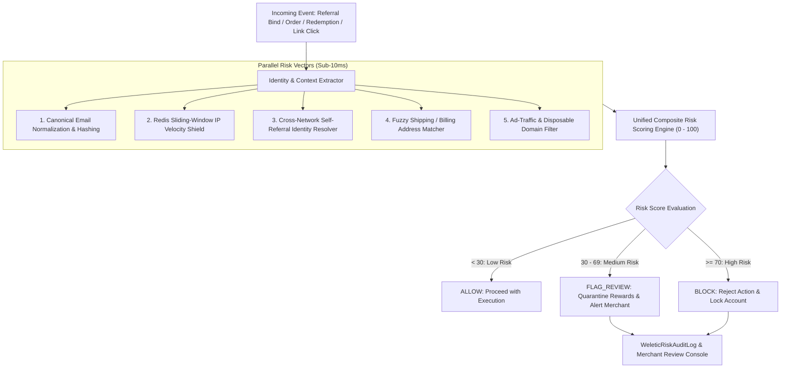

# ADR-003: Cross-Network Fraud & Anomaly Shield (Unified Anti-Abuse, Canonical Hashing & Velocity Engine)

- **Date**: 2026-08-17
- **Status**: Proposed
- **Stakeholders**: Hiro (PO), Worker 3 (impl/author)
- **Target Subsystems**: Customer Loyalty, Partner Affiliate, Ingestion Gateway, Storefront APIs

---

## 1. Context

Weletic Room operates a unified platform combining **Partner Affiliates** (cash commissions, public creator Rooms) and **Customer Loyalty** (points, vouchers, VIP tiers, customer referrals). During the initial release audit and security review, four critical anti-abuse vulnerabilities were identified across both subsystems:

1. **Unenforced IP Validation in Loyalty Referrals**:
   While `WeleticLoyaltyReferralRule.fraudCheckSameIp` is set to `true` by default in Prisma schema, the runtime referral service (`apps/web/lib/weletic/loyalty/referrals.ts`) only records the client IP in audit metadata without asserting equality or rate limits between the advocate and referee.
2. **Email Subaddressing & Alias Recycling (Sybil Attacks)**:
   Neither system normalizes email addresses against subaddressing (`user+alias@gmail.com`) or provider dot-insensitivity (`u.s.e.r@gmail.com`). Fraudulent actors can automate dozens of synthetic shopper accounts from a single inbox to harvest welcome bonus points and 1-click discount vouchers (`WL-XXXXXXXX`).
3. **Cross-Network Self-Referral & Double-Dipping**:
   Because the Partner and Customer Loyalty models are strictly decoupled per ADR-0003, there is no cross-network identity correlation during checkout. An affiliate partner can purchase products through their own affiliate link, earn a 10–15% fiat commission, and simultaneously redeem customer loyalty points and friend referral discounts on the exact same order.
4. **Referral Binding Velocity Spikes & Bot Farms**:
   There is no rate limiting on referral bindings or discount redemptions per IP or CIDR block, leaving the checkout surface vulnerable to automated coupon-scraping bots and multi-account referral farms.

---

## 2. Decision

Weletic Room will introduce a **Cross-Network Fraud & Anomaly Shield** that evaluates every critical commerce, loyalty, and affiliate event through a high-performance, unified risk scoring engine.



### 2.1 Canonical Email Normalization & Hashing

To prevent email alias recycling and multi-account harvesting without storing cross-context plaintext emails in violation of privacy boundaries, the engine normalizes all email inputs into a canonical SHA-256 hash:

#### Normalization Algorithm:

```typescript
export function canonicalizeEmail(rawEmail: string): string {
  if (!rawEmail || typeof rawEmail !== "string") return "";

  const [localPart, domainPart] = rawEmail.toLowerCase().trim().split("@");
  if (!localPart || !domainPart) return rawEmail.toLowerCase().trim();

  let normalizedLocal = localPart;

  // Handle Google / Gmail / Googlemail (strip dots, strip +tags)
  if (domainPart === "gmail.com" || domainPart === "googlemail.com") {
    normalizedLocal = normalizedLocal.replace(/\./g, "");
    normalizedLocal = normalizedLocal.split("+")[0];
    return `${normalizedLocal}@gmail.com`;
  }

  // Handle Microsoft Outlook / Hotmail / Live (strip +tags)
  if (
    domainPart === "outlook.com" ||
    domainPart === "hotmail.com" ||
    domainPart === "live.com"
  ) {
    normalizedLocal = normalizedLocal.split("+")[0];
    return `${normalizedLocal}@${domainPart}`;
  }

  // Handle iCloud / ProtonMail / Yahoo (strip +tags / -tags)
  if (
    domainPart === "icloud.com" ||
    domainPart === "protonmail.com" ||
    domainPart === "pm.me"
  ) {
    normalizedLocal = normalizedLocal.split("+")[0];
    return `${normalizedLocal}@${domainPart}`;
  }

  if (domainPart === "yahoo.com") {
    normalizedLocal = normalizedLocal.split("-")[0];
    return `${normalizedLocal}@yahoo.com`;
  }

  // Generic fallback: strip standard + subaddressing
  normalizedLocal = normalizedLocal.split("+")[0];
  return `${normalizedLocal}@${domainPart}`;
}

export function computeCanonicalEmailHash(email: string): string {
  const canonical = canonicalizeEmail(email);
  return crypto.createHash("sha256").update(canonical).digest("hex");
}
```

- **Collision Detection**: If a new customer enrollment or referral bind produces a `canonicalEmailHash` that already exists in the store or matches an active `Partner`, it is immediately flagged for self-referral / multi-account abuse.

---

### 2.2 Redis Sliding-Window IP Velocity Shield

Referral binding (`bindShopperReferral`) and reward voucher redemption (`redeemRewardVoucher`) are guarded by an atomic Redis sliding-window rate limiter executed via Lua script:

#### Rate Limits:

- **Referral Binding Velocity**: Maximum **3 referral binds** per IPv4 (or `/24` subnet) / IPv6 (or `/64` prefix) within a rolling **24-hour window**.
- **Reward Voucher Redemptions**: Maximum **5 redemptions** per IP within a rolling **1-hour window**.
- **Same-IP Advocate $\leftrightarrow$ Referee Block**: When `fraudCheckSameIp` is active, binding is immediately rejected if the referee IP matches the advocate's last active IP within 7 days.

#### Redis Sliding-Window Lua Script (`apps/web/lib/weletic/fraud/sliding-window.lua`):

```lua
-- KEYS[1]: Rate limit key (e.g. "fraud:velocity:bind:{storeId}:{ip}")
-- ARGV[1]: Current timestamp in milliseconds (now)
-- ARGV[2]: Window size in milliseconds (e.g. 86400000 for 24h)
-- ARGV[3]: Max allowed requests in window (e.g. 3)
-- ARGV[4]: Unique event ID (e.g. requestId / shopperId)

local key = KEYS[1]
local now = tonumber(ARGV[1])
local window = tonumber(ARGV[2])
local maxAllowed = tonumber(ARGV[3])
local eventId = ARGV[4]

local clearBefore = now - window

-- 1. Remove expired events older than window
redis.call('ZREMRANGEBYSCORE', key, '-inf', clearBefore)

-- 2. Count remaining events in current sliding window
local currentCount = redis.call('ZCARD', key)

if currentCount < maxAllowed then
    -- 3. Add current event
    redis.call('ZADD', key, now, eventId)
    -- 4. Refresh TTL to match window duration
    redis.call('PEXPIRE', key, window)
    return { 1, currentCount + 1, maxAllowed - (currentCount + 1) } -- Allowed: { 1, count, remaining }
else
    return { 0, currentCount, 0 } -- Denied: { 0, count, 0 }
end
```

---

### 2.3 Cross-Network Self-Referral & Double-Dipping Blocker

To prevent partners from gaming commissions and loyalty bonuses simultaneously:

1. **Identity Fingerprinting**:
   During order processing (`recordWeleticOrder`), the system hashes:
   - `canonicalEmailHash`
   - Normalized shipping address (`soundex(address1) + zip + country`)
   - Payment method token hash (from Shopify checkout payload)
2. **Cross-Network Correlation**:
   If an incoming order is attributed to `Partner X`:
   - The engine checks if the purchasing `WeleticShopper` shares the same `canonicalEmailHash`, shipping address, or payment method token as `Partner X`.
   - If a collision is detected, the transaction is marked as a **Self-Purchase Violation**.

---

### 2.4 Unified Composite Risk Scoring Engine (0–100)

Every transaction is evaluated across 5 weighted risk vectors:

$$S_{\text{risk}} = \min\left(100, \sum_{i=1}^{5} w_i \cdot V_i\right)$$

```
+----------------------------------------------------------------------------------------------------+
| Risk Vector (Vi)                    | Weight (wi) | Trigger Criteria & Vector Score Calculation   |
+----------------------------------------------------------------------------------------------------+
| 1. Cross-Network Self-Referral      | 0.40        | V1 = 100 if Partner & Shopper Email/Hash match |
|                                     |             | V1 = 70 if Shipping/Payment token matches      |
| 2. Canonical Email Alias Recycling  | 0.25        | V2 = 100 if Canonical Hash has >=2 accounts   |
|                                     |             | V2 = 60 if Disposable/Temporary Email Domain   |
| 3. IP Velocity Threshold Exceeded   | 0.20        | V3 = 100 if >3 binds / IP / 24h                |
|                                     |             | V3 = 80 if Same-IP Advocate-Referee Collision  |
| 4. Address Fuzzy Mismatch/Farm      | 0.10        | V4 = 100 if Shipping address matches >=5 accts|
| 5. Ad Traffic Parameter Infiltration| 0.05        | V5 = 100 if Paid click tags (gclid) on org/ref |
+----------------------------------------------------------------------------------------------------+
```

#### Decision Matrix & Enforcement Pipeline:

```
Score Range   Action         System Enforcement Behavior
----------------------------------------------------------------------------------------------------
  0 - 29      ALLOW          Clean transaction. Points credited, commissions processed normally.
 30 - 69      FLAG_REVIEW    Quarantine state. Points held in 'cachedPendingPoints', commissions
                             held in 'hold' status. FraudAlert created for Merchant Admin triage.
 70 - 100     BLOCK          Immediate rejection. Referral binding rejected with error message;
                             order points/commissions voided; account flagged for suspension.
```

---

### 2.5 Storage & Prisma Schema Extensions

```prisma
// apps/web/prisma/schema/fraud.prisma

enum WeleticRiskAction {
  ALLOW
  FLAG_REVIEW
  BLOCK
}

enum WeleticRiskVectorType {
  CROSS_NETWORK_SELF_REFERRAL
  CANONICAL_EMAIL_COLLISION
  DISPOSABLE_EMAIL_DOMAIN
  IP_VELOCITY_BREACH
  SAME_IP_REFERRAL
  SHIPPING_ADDRESS_CLUSTER
  PAID_TRAFFIC_INFILTRATION
}

model WeleticFraudRiskAssessment {
  id              String            @id
  storeId         String
  eventType       String            // ORDER, REFERRAL_BIND, REWARD_REDEMPTION
  eventReferenceId String           // orderId, referralId, redemptionId
  shopperId       String?
  partnerId       String?
  ipAddress       String
  riskScore       Int               // 0 - 100
  action          WeleticRiskAction
  flaggedVectors  Json              @db.Json // Array of { vector: WeleticRiskVectorType, score: number, details: string }
  isOverridden    Boolean           @default(false)
  overriddenById  String?
  overriddenAt    DateTime?
  overrideReason  String?           @db.Text
  createdAt       DateTime          @default(now())

  store      WeleticShopifyStore @relation(fields: [storeId], references: [id], onDelete: Cascade)
  shopper    WeleticShopper?     @relation(fields: [shopperId], references: [id], onDelete: SetNull)
  partner    Partner?            @relation(fields: [partnerId], references: [id], onDelete: SetNull)
  overriddenBy User?             @relation(fields: [overriddenById], references: [id])

  @@index([storeId, action, createdAt])
  @@index([storeId, riskScore])
  @@index([eventReferenceId])
  @@index([shopperId])
  @@index([partnerId])
}

model WeleticCanonicalIdentity {
  id                 String   @id
  canonicalEmailHash String   @unique // sha256(canonicalizeEmail(email))
  primaryEmail       String
  shopperIds         Json     @db.Json // Array of linked shopper IDs
  partnerIds         Json     @db.Json // Array of linked partner IDs
  firstSeenAt        DateTime @default(now())
  updatedAt          DateTime @updatedAt

  @@index([canonicalEmailHash])
}

model WeleticRiskAuditLog {
  id           String   @id
  assessmentId String
  actorId      String?  // Merchant user ID or 'SYSTEM'
  actionTaken  String   // QUARANTINE_RELEASED, MANUAL_BLOCK, VECTOR_WHITELIST
  note         String?  @db.Text
  createdAt    DateTime @default(now())

  assessment WeleticFraudRiskAssessment @relation(fields: [assessmentId], references: [id], onDelete: Cascade)

  @@index([assessmentId])
}
```

---

### 2.6 Merchant Review & Override Workflow

When a transaction receives a `FLAG_REVIEW` action:

1. **Automated Holding**:
   - Commissions are placed in `hold` status via `holdPendingCommissions` (`apps/web/lib/api/fraud/actions/hold-pending-commissions.ts`).
   - Loyalty points remain in `cachedPendingPoints` beyond the standard holding period until merchant resolution.
2. **Merchant Dashboard Triage (`/analytics/fraud`)**:
   - Displays risk score breakdown and triggered vector evidence.
   - 1-Click **Approve & Release**: Commits points ledger entry, releases commission hold, writes `WeleticRiskAuditLog`.
   - 1-Click **Confirm Fraud & Ban**: Revokes points, sets referral status to `fraud_blocked`, suspends partner enrollment, broadcasts ban across store network.

---

## 3. Alternatives Considered

1. **Third-Party Fraud SaaS (Sift, Radar, Riskified)**:
   - _Rejected for core scoring_: High cost per API call ($0.03–$0.08 per checkout), inability to inspect internal cross-network loyalty/affiliate schema relationships, and privacy/GDPR compliance friction.
   - _Decision_: Build native high-performance in-house shield tailored specifically to Shopify affiliate + loyalty dynamics.
2. **Hard-Blocking Everything Above Score 30**:
   - _Rejected_: Caused high false-positive rates on shared campus, office, and cellular carrier NAT IP addresses.
   - _Decision_: Introduce the dual-tier `FLAG_REVIEW` (quarantine) vs `BLOCK` (hard reject) threshold.
3. **Plaintext Cross-Database Email Queries**:
   - _Rejected_: Violates ADR-0003 schema isolation and leaks customer PII into partner contexts.
   - _Decision_: Use one-way `canonicalEmailHash` matching via `WeleticCanonicalIdentity`.

---

## 4. Consequences

### Positive

- **Zero Double-Dipping**: Eliminates affiliate self-purchases and unearned dual-reward harvests.
- **Sybil Resistance**: Blocks Gmail alias farms from harvesting welcome vouchers and referral bonus points.
- **Real-Time Protection**: Redis sliding window Lua script executes in $<5\text{ms}$ with zero perceptible latency on checkout or widget binding.
- **Auditability**: Complete forensic trail for all flagged events and merchant override actions.

### Negative / Trade-offs Accepted

- **Redis Dependency**: Requires highly available Redis cluster for sliding-window rate limiting.
- **Maintenance of Email Provider Normalization**: Requires periodic updates as email providers introduce new subaddressing schemes.

---

## 5. References

- ADR-0003: Customer loyalty bounded context (`docs/adr/0003-customer-loyalty-bounded-context.md`)
- ADR-0004: Loyalty activation and balance policies (`docs/adr/0004-loyalty-activation-and-balance-policies.md`)
- Referral service implementation (`apps/web/lib/weletic/loyalty/referrals.ts`)
- Affiliate fraud rules (`apps/web/lib/api/fraud/rules/check-customer-email-match.ts`)
- Upstream Dub Fraud Group schema (`apps/web/prisma/schema/fraud.prisma`)
