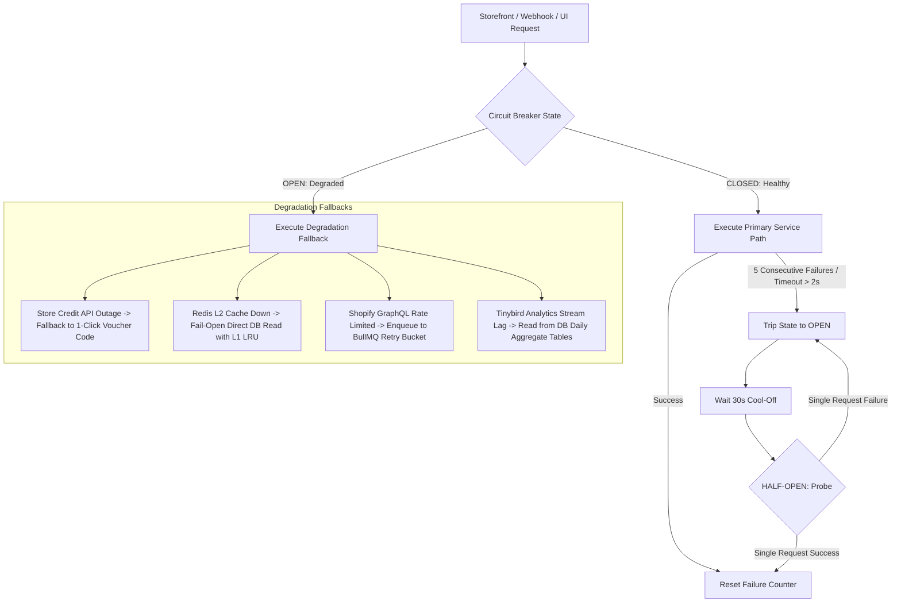

# Weletic Commerce Platform: Risk Analysis & Failure Modes Specification

**Document Version:** 1.0.0  
**Status:** Canonical Security & Reliability Specification  
**Author:** Master Platform Architect & Roadmap Strategist (Worker 4)  
**Target Systems:** Weletic Commerce Platform (`apps/web`, `packages/weletic`, Infrastructure & Edge)  
**Related Specifications & ADRs:**

- `docs/architecture/WELETIC_COMMERCE_MASTER_ARCHITECTURE.md`
- `docs/adrs/ADR-001-SHOPIFY-PLUS-CHECKOUT-UI-EXTENSION.md`
- `docs/adrs/ADR-002-DISTRIBUTED-QUEUE-BACKFILL-PIPELINE.md`
- `docs/adrs/ADR-003-CROSS-NETWORK-FRAUD-ANOMALY-SHIELD.md`

---

## 1. Executive Summary & Threat Taxonomy

As a mission-critical commerce and financial ledger platform handling real monetary transactions, customer loyalty balances, and creator payouts, Weletic must maintain extreme fault tolerance.

This document identifies, analyzes, and defines automated mitigations for all known failure modes across **concurrency, webhook reordering, API throttling, multi-account fraud, financial liability, backfill exhaustion, edge networking, and database contention**.

### Severity Classification Matrix

|  Severity Level   | Definition                                                                                        | Maximum Tolerable Downtime / Latency | Target MTTR (Mean Time to Recovery) |
| :---------------: | ------------------------------------------------------------------------------------------------- | :----------------------------------: | :---------------------------------: |
| **P0 (Critical)** | Financial ledger corruption, double-spending of points/money, widespread checkout disruption.     |    **0 minutes** (Zero Data Loss)    |           **< 5 minutes**           |
|   **P1 (High)**   | Webhook backlog accumulation, rate limit throttling, elevated storefront widget latency (>500ms). |           **< 15 minutes**           |          **< 30 minutes**           |
|  **P2 (Medium)**  | Non-order earning delays (birthdays, reviews), non-critical analytics sync delays.                |            **< 4 hours**             |            **< 2 hours**            |
|   **P3 (Low)**    | Administrative reporting discrepancies, transient UI cache inconsistencies.                       |            **< 24 hours**            |            **< 8 hours**            |

---

## 2. Comprehensive Risk Assessment Matrix

|    #    | Risk Domain   | Specific Failure Mode                                                 | Severity | Likelihood | System Impact                                                                                            | Automated Mitigation / Protocol                                                                         |
| :-----: | ------------- | --------------------------------------------------------------------- | :------: | :--------: | -------------------------------------------------------------------------------------------------------- | ------------------------------------------------------------------------------------------------------- |
| **R01** | Concurrency   | Concurrent multi-tab points redemption at checkout                    |  **P0**  |    High    | Customer redeems 1,000 points multiple times across tabs ($50 off for $10 in points).                    | **Atomic 15-Minute Redis Lua Reservation Lock** with available balance checks (`reserve_points.lua`).   |
| **R02** | Concurrency   | Redis partition / split-brain during checkout reservation             |  **P1**  |    Low     | Inability to acquire reservation locks in one region.                                                    | **Fail-Safe Fallback**: Degrade to pre-checkout single-use voucher code with DB row locking.            |
| **R03** | Webhooks      | Shopify webhook 5s timeout & auto-subscription deletion               |  **P0**  |    High    | App receives 19 consecutive timeouts during flash sale; Shopify deletes webhook subscriptions.           | **Fast-Path Webhook Decoupling (<150ms Ack)** to BullMQ / QStash queue with HMAC auth only.             |
| **R04** | Webhooks      | Out-of-order delivery (`refunds/create` arrives before `orders/paid`) |  **P1**  |   Medium   | Refund reversal attempts to claw back points from an order not yet in the ledger.                        | **Pending Refund Reconciliation State**: Buffer refund in Redis/DB with 10-minute retry window.         |
| **R05** | Rate Limits   | Shopify GraphQL API 40 cost pts/sec throttle (`THROTTLED`)            |  **P1**  |    High    | Historical order backfills or bulk discount creation fail with HTTP 429.                                 | **Distributed Token Bucket Rate Limiter** (Redis Lua) with jittered exponential backoff.                |
| **R06** | Rate Limits   | Store Credit GraphQL API 500 error / scope rejection                  |  **P1**  |   Medium   | Points debited from ledger but monetary credit not issued on Shopify customer account.                   | **Compensating Saga Rollback**: Immediate automatic `MANUAL_ADJUSTMENT` points credit restore.          |
| **R07** | Fraud / Sybil | Email subaddressing / alias recycling (`user+promo@gmail.com`)        |  **P1**  |    High    | Synthetic accounts harvest unlimited welcome points & 1-click discount vouchers.                         | **Canonical Email Hashing (SHA-256)** stripping dots/tags across Gmail, Outlook, iCloud, Yahoo.         |
| **R08** | Fraud / Sybil | Cross-network self-purchase & double-dipping                          |  **P0**  |   Medium   | Creator buys through own affiliate link, gets 15% cash commission + customer points + referral discount. | **Cross-Network Identity Correlator**: Blocks self-attribution on matching email/address/payment token. |
| **R09** | Fraud / Sybil | Referral binding bot velocity spikes (>100 binds/min)                 |  **P1**  |    High    | Scrapers generate thousands of synthetic referral accounts to harvest referee discounts.                 | **Sliding-Window Redis IP Velocity Shield**: Max 3 referral binds per IP / CIDR subnet per 24h.         |
| **R10** | Financial     | Zero-decimal currency points inflation (JPY/VND 100x exploit)         |  **P0**  |    High    | JPY/VND shoppers receive 100x points, enabling 200% return on spend and massive merchant loss.           | **Rational 12-Decimal Base Normalization** (`calculateCalibratedOrderPoints`) to USD base.              |
| **R11** | Financial     | Uncapped campaign multiplier stacking (2x _ 3x _ 1.5x = 9x)           |  **P1**  |   Medium   | Overlapping marketing campaigns award un-budgeted points multipliers to VIP tiers.                       | **Deterministic Campaign Stacking Policy**: Enforce `multiply`, `highest_wins`, or `additive` caps.     |
| **R12** | Scalability   | Node.js Heap OOM on 100k+ historical order backfill                   |  **P0**  |    High    | Serverless / container instances crash with Out-Of-Memory when querying 500k orders.                     | **Chunked Cursor Streaming (250 orders/chunk)** with Redis cursor checkpoint recovery.                  |
| **R13** | Edge Routing  | Vanity referral shortlink DNS hijacking or cache poisoning            |  **P1**  |    Low     | Customer referral links redirect to malicious phishing sites or break checkout.                          | **Cloudflare Edge SSL Termination** + Signed Redis cache keys (`loyalty:refcode:{domain}:{code}`).      |
| **R14** | Database      | Connection pool exhaustion during Black Friday flash sales            |  **P0**  |    High    | Database locks up under 1,500 QPS widget reads; checkout and webhooks fail.                              | **2-Tier Read Caching (In-Memory LRU + Redis Global)** absorbing >99.6% of database reads.              |

---

## 3. In-Depth Failure Mode Deep Dives & Mitigation Protocols

---

### 3.1 Failure Mode 1: High-Concurrency Double-Redemption at Checkout

```
┌──────────────────────────────────────────────────────────────────────────────────────────────────┐
│ THREAT SCENARIO: Flash-Sale Multi-Tab Points Double-Spending                                     │
│ 1. Customer has 1,000 Points ($10 value).                                                        │
│ 2. Customer opens 5 concurrent checkout browser tabs during a flash sale.                        │
│ 3. Customer submits 1,000 point redemptions simultaneously in all 5 tabs.                        │
│ 4. Unprotected system generates 5 discount codes ($50 total), debiting ledger asynchronously.   │
│ 5. Merchant loses $40 in unearned merchandise discount.                                         │
└──────────────────────────────────────────────────────────────────────────────────────────────────┘
```

#### Detailed Anatomy & Attack Vector

In standard asynchronous webhook architectures, the points ledger is not debited until Shopify dispatches the `orders/paid` webhook (which can arrive 2 to 30 seconds after customer checkout submission). If the UI allows generating discount codes directly against the customer's cached balance without reservation locking, an attacker can issue parallel HTTP requests to generate multiple independent discount codes before any ledger deduction occurs.

#### Mitigation Protocol: Atomic 15-Minute Redis Lua Reservation Lock

Weletic enforces an atomic two-phase reservation lock backed by Upstash Redis:

```lua
-- reserve_points.lua (Executed atomically in Redis)
local totalBalance = tonumber(redis.call('GET', KEYS[1]) or '0')
local pointsRequested = tonumber(ARGV[2])
local ttl = tonumber(ARGV[4])
local now = tonumber(ARGV[5])

-- 1. Calculate active unexpired locks
local totalLocked = 0
local existingLocks = redis.call('HGETALL', KEYS[2])
for i = 1, #existingLocks, 2 do
    local lockData = cjson.decode(existingLocks[i+1])
    if lockData.expiresAt > now then
        totalLocked = totalLocked + tonumber(lockData.pointsLocked)
    else
        redis.call('HDEL', KEYS[2], existingLocks[i]) -- Prune stale
    end
end

-- 2. Assert sufficient unlocked balance
local available = totalBalance - totalLocked
if available < pointsRequested then
    return cjson.encode({ success = false, reason = "INSUFFICIENT_AVAILABLE_BALANCE", available = available })
end

-- 3. Acquire reservation lock
local lockPayload = { reservationId = ARGV[1], pointsLocked = pointsRequested, expiresAt = now + ttl }
redis.call('HSET', KEYS[2], ARGV[1], cjson.encode(lockPayload))
redis.call('EXPIRE', KEYS[2], ttl + 60)
return cjson.encode({ success = true, reservationId = ARGV[1] })
```

- **Lock Expiration**: If the customer abandons checkout, the 900-second (15-minute) TTL automatically expires, restoring 100% of available points without database mutation or ledger pollution.
- **Commit Settlement**: When `orders/paid` arrives, the settlement worker releases the Redis lock and atomically appends `WeleticPointsLedgerEntry` with `pointsDelta = -N`.

---

### 3.2 Failure Mode 2: Out-of-Order Webhook Delivery (`refunds/create` before `orders/paid`)

```
┌──────────────────────────────────────────────────────────────────────────────────────────────────┐
│ THREAT SCENARIO: Network Jitter Causing Inverted Webhook Sequence                                │
│ 1. Order placed at t=0; Customer immediately requests cancellation/refund at t=2s.               │
│ 2. Network congestion delays orders/paid webhook delivery until t=15s.                           │
│ 3. Shopify dispatches refunds/create webhook, which arrives at t=4s (before orders/paid).        │
│ 4. Unprotected refund worker fails to find WeleticCommerceOrder, dropping the refund clawback.  │
│ 5. orders/paid arrives at t=15s and grants full points, resulting in unearned points on refund.  │
└──────────────────────────────────────────────────────────────────────────────────────────────────┘
```

#### Mitigation Protocol: Pending Refund Reconciliation Buffer

1. When `refunds/create` arrives, the worker attempts to locate the parent `WeleticCommerceOrder`.
2. If the order is not found, the refund payload is written to Redis buffer `webhook:pending_refund:{storeId}:{shopifyOrderId}` with a TTL of 600 seconds (10 minutes).
3. When `orders/paid` arrives and completes standard order ingestion and points grant, it immediately queries Redis for pending refund buffers matching the `shopifyOrderId`.
4. If a pending refund is found, `processRefundPointsReversal` is executed synchronously within the same job lifecycle, ensuring exact proportional points clawback regardless of webhook arrival order.

---

### 3.3 Failure Mode 3: Shopify GraphQL Rate Limits (40 Cost Points/Sec Ceiling)

```
┌──────────────────────────────────────────────────────────────────────────────────────────────────┐
│ THREAT SCENARIO: Rate-Limit Starvation during Bulk Operations                                    │
│ 1. Merchant initiates 100k historical order backfill.                                            │
│ 2. Unthrottled workers dispatch 50 parallel GraphQL queries to Shopify Admin API.                │
│ 3. Bucket capacity (200 points) is exhausted within 200ms; Shopify returns HTTP 429 THROTTLED.  │
│ 4. Unhandled 429s crash workers, aborting the backfill and impacting real-time discount creation.│
└──────────────────────────────────────────────────────────────────────────────────────────────────┘
```

#### Mitigation Protocol: Distributed Leaky Bucket Rate Limiter

All external Shopify GraphQL queries pass through a centralized Redis Leaky Bucket token synchronizer:

- **Bucket Capacity**: 200 points (Standard) / 400 points (Shopify Plus).
- **Leak Rate**: 40 points/second (Standard) / 80 points/second (Plus).
- **Cost Calculation**: Every GraphQL query calculates its static query complexity using `cost { requestedQueryCost actualQueryCost }`.
- **Pre-Flight Acquisition**: The worker must acquire the exact requested cost points from Redis before dispatching the HTTP request. If tokens are unavailable, the worker sleeps for `(requested - available) / leakRate` milliseconds plus random jitter (10–50ms).

---

### 3.4 Failure Mode 4: Sybil Attacks & Gmail Alias Recycling

```
┌──────────────────────────────────────────────────────────────────────────────────────────────────┐
│ THREAT SCENARIO: Automated Welcome Voucher & Referral Point Harvesting                           │
│ 1. Attacker controls a single inbox: attacker@gmail.com.                                         │
│ 2. Attacker automates 500 account creations using attacker+1@gmail.com, attacker+2@gmail.com... │
│ 3. System provisions 500 WeleticShopper records, granting 100 welcome points and $5 vouchers.     │
│ 4. Attacker uses bot to refer their own aliases, collecting thousands in referral bonus points.  │
└──────────────────────────────────────────────────────────────────────────────────────────────────┘
```

#### Mitigation Protocol: Canonical Email Normalization & Identity Shield

Before creating any `WeleticShopper`, binding a referral, or awarding welcome bonuses, the system computes the `canonicalEmailHash`:

```typescript
// Deterministic normalization stripping dots and +tags
export function canonicalizeEmail(rawEmail: string): string {
  const [localPart, domainPart] = rawEmail.toLowerCase().trim().split("@");
  if (["gmail.com", "googlemail.com"].includes(domainPart)) {
    return `${localPart.replace(/\./g, "").split("+")[0]}@gmail.com`;
  }
  if (
    ["outlook.com", "hotmail.com", "live.com", "icloud.com"].includes(
      domainPart,
    )
  ) {
    return `${localPart.split("+")[0]}@${domainPart}`;
  }
  return `${localPart.split("+")[0]}@${domainPart}`;
}
```

- **Collision Rule**: If `sha256(canonicalizeEmail(email))` already exists for another account in the same store:
  1. Welcome bonus points are blocked.
  2. Referral binding to another alias sharing the same canonical hash is rejected with `SELF_REFERRAL_BLOCKED`.
  3. The account is assigned a risk score vector `CANONICAL_EMAIL_COLLISION` (Score: 100).

---

### 3.5 Failure Mode 5: Zero-Decimal JPY/VND Points Inflation Vulnerability

```
┌──────────────────────────────────────────────────────────────────────────────────────────────────┐
│ THREAT SCENARIO: 100x Points Inflation on Zero-Decimal Currencies                                │
│ 1. Legacy code: majorUnits = isZeroDecimal ? Number(netCents) : Number(netCents)/100;           │
│ 2. Customer buys ¥10,000 JPY ($65 USD value) -> System treats netCents as 10000 -> 10,000 Points!│
│ 3. If reward is 500 Points = ¥1,000 Voucher, customer redeems TWENTY ¥1,000 Vouchers (¥20,000!). │
│ 4. Result: 200% financial return on spend; merchant loses massive revenue.                      │
└──────────────────────────────────────────────────────────────────────────────────────────────────┘
```

#### Mitigation Protocol: 12-Decimal Rational Program Base Currency Normalization

All loyalty calculations strictly normalize order spend into the merchant's **Program Base Accounting Currency** (e.g. `USD`):

$$\text{Normalized Base Spend} = \text{Presentment Major Amount} \times \text{FX Rate}(\text{Presentment} \rightarrow \text{Base})$$
$$\text{Points Earned} = \left\lfloor \text{Normalized Base Spend} \times \text{PointsPerBaseUnit} \times \text{TierMultiplier} \right\rfloor$$

```typescript
// Calibrated implementation in apps/web/lib/weletic/loyalty/earn.ts
const isZeroDecimal = isZeroDecimalCurrency(presentmentCurrency);
const presentmentMajorUnits = isZeroDecimal
  ? Number(netMinor)
  : Number(netMinor) / 100.0;
const normalizedBaseSpend = presentmentMajorUnits * fxRate;
const earnedPoints = Math.floor(
  normalizedBaseSpend * pointsPerBaseUnit * tierMultiplier,
);
```

- **Validation Assertion**: ¥10,000 JPY at 155.00 USD/JPY yields $\frac{10000}{155.00} \times 1.0 \approx 64$ points (identical to spending $64 USD).

---

### 3.6 Failure Mode 6: Node.js Heap OOM during 100k+ Order Backfills

```
┌──────────────────────────────────────────────────────────────────────────────────────────────────┐
│ THREAT SCENARIO: Unbounded Memory Allocation Crashing Workers                                    │
│ 1. Merchant with 500,000 historical orders initiates loyalty points backfill.                   │
│ 2. Unpaginated query: prisma.weleticCommerceOrder.findMany() loads 500k rows into memory.       │
│ 3. Node.js heap reaches 1.4GB limit; runtime terminates with JavaScript heap out of memory.     │
│ 4. Serverless worker crashes mid-execution; backfill left in zombie state with no resume point.  │
└──────────────────────────────────────────────────────────────────────────────────────────────────┘
```

#### Mitigation Protocol: Chunked Cursor Streaming with Redis Checkpoints

The backfill pipeline decomposes datasets into strictly bounded 250-order chunks:

1. **Indexed Cursor Query**: Queries use `cursor: { id: lastEvaluatedOrderId }` and `take: 250` utilizing primary key B-tree index scans.
2. **Bounded Heap Footprint**: Memory usage is capped at $<80\text{KB}$ per chunk, keeping total worker heap below $64\text{MB}$.
3. **Atomic Redis Checkpointing**: After every chunk, the worker updates `weletic:backfill:{jobId}:cursor` with `{ lastEvaluatedOrderId, processedOrdersCount }`.
4. **Crash Resiliency**: If a worker process is preempted, the next worker resumes immediately from the exact Redis cursor without reprocessing previous chunks.

---

## 4. Automated Failover, Circuit Breakers & Disaster Recovery (DR)

### 4.1 Circuit Breaker Architecture



### 4.2 Disaster Recovery SLAs & Recovery Objectives

| Subsystem                                        | RPO (Recovery Point Objective) | RTO (Recovery Time Objective) | Disaster Recovery Strategy                                                                                    |
| ------------------------------------------------ | :----------------------------: | :---------------------------: | ------------------------------------------------------------------------------------------------------------- |
| **Points Ledger (`WeleticPointsLedgerEntry`)**   |   **0 seconds** (Zero Loss)    |        **< 1 minute**         | Multi-region PostgreSQL automated failover with synchronous replication.                                      |
| **Active Checkout Locks (`loyalty:lock:*`)**     |        **< 15 minutes**        |       **< 30 seconds**        | Locks are ephemeral (TTL 15m). Upon Redis reset, active checkouts gracefully re-lock or fallback to vouchers. |
| **Webhook Ingestion Queue (`weletic-webhooks`)** |         **0 seconds**          |        **< 5 minutes**        | Upstash QStash multi-AZ persistent message queues with automatic retries and DLQ.                             |
| **Storefront Read Cache (L1/L2)**                |      **N/A** (Disposable)      |       **Instantaneous**       | Fail-open design directly serves reads from primary database replicas.                                        |
| **Tinybird Analytics Event Stream**              |        **< 5 minutes**         |         **< 1 hour**          | Materialized views can be completely re-piped from `WeleticCommerceOrder` historical logs.                    |

---

_Risk Analysis & Failure Modes Specification authored and certified by Worker 4._
