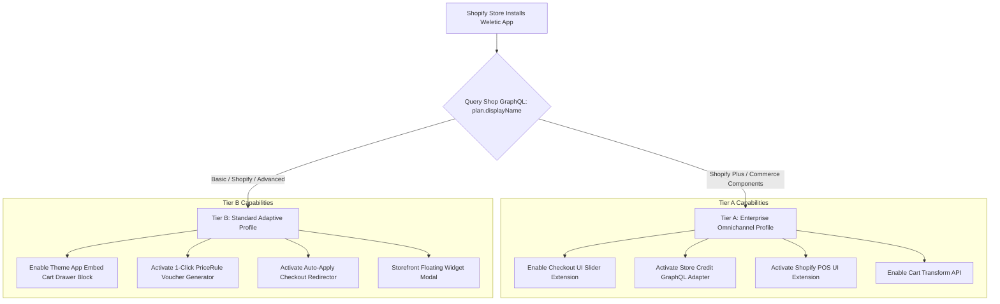
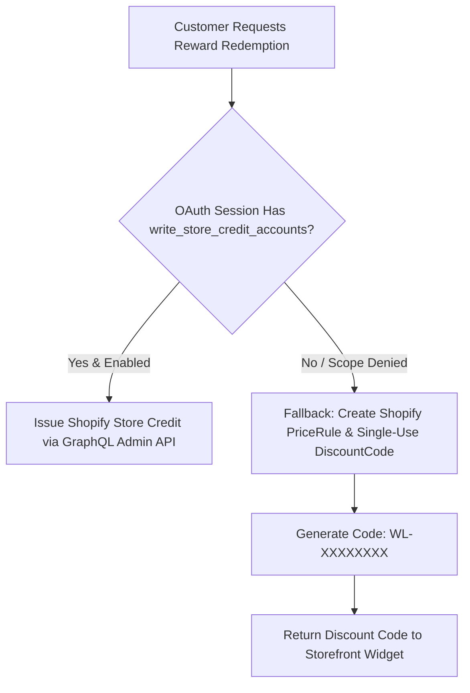

# Weletic Commerce Platform: Shopify API Compatibility & Plan Matrix Guide

**Document Version:** 1.0.0  
**Status:** Canonical Shopify API Integration Specification  
**Author:** Master Platform Architect & Roadmap Strategist (Worker 4)  
**Target Systems:** Weletic Commerce Platform (`apps/web`, Storefront SDK, Merchant Admin)  
**Related Specifications & ADRs:**

- `docs/architecture/WELETIC_COMMERCE_MASTER_ARCHITECTURE.md`
- `docs/adrs/ADR-001-SHOPIFY-PLUS-CHECKOUT-UI-EXTENSION.md`
- `docs/adrs/ADR-002-DISTRIBUTED-QUEUE-BACKFILL-PIPELINE.md`

---

## 1. Executive Summary & Ecosystem Positioning

Shopify powers millions of merchants across multiple subscription tiers: **Shopify Basic, Shopify (Standard), Advanced Shopify, Shopify Plus, and Commerce Components (Headless / Hydrogen)**.

Because Shopify enforces strict API and feature boundaries based on merchant subscription tiers—most notably restricting **Checkout UI Extensions** and **Multipass SSO** to Shopify Plus—the Weletic Commerce Platform implements an **Adaptive Multi-Tier Architecture**.

This architecture dynamically detects the merchant's plan and provisions the optimal surface:

- **Shopify Plus & Commerce Components**: Native in-checkout slider extension, Store Credit API integration, and Shopify Functions discount stacking.
- **Basic, Standard & Advanced Plans**: Seamless 1-click cart drawer app embed blocks, auto-apply redirect URLs (`/discount/{code}?redirect=/checkout`), and single-use PriceRule vouchers.



---

## 2. Comprehensive Shopify Plan Compatibility Matrix

| Feature / API Capability                                                 |    Shopify Basic    | Shopify (Standard)  |  Advanced Shopify   |    Shopify Plus     |     Commerce Components / Hydrogen     | Weletic Fallback Strategy on Incompatibility                                                       |
| ------------------------------------------------------------------------ | :-----------------: | :-----------------: | :-----------------: | :-----------------: | :------------------------------------: | -------------------------------------------------------------------------------------------------- |
| **Checkout UI Extensions** (`purchase.checkout.reductions.render-after`) |    ❌ Restricted    |    ❌ Restricted    |    ❌ Restricted    | ✅ **Full Support** | ✅ **Full Support** (via Checkout API) | **Fallback**: Theme App Embed Cart Drawer with 1-click claim & `/discount/CODE?redirect=checkout`. |
| **Shopify Store Credit API** (`storeCreditAccountCredit`, `2024-04`+)    |   ✅ Supported\*    |   ✅ Supported\*    |   ✅ Supported\*    | ✅ **Full Support** |          ✅ **Full Support**           | **Fallback**: Single-use `PriceRule` discount code (`WL-XXXXXXXX`) if scopes ungranted.            |
| **Cart Transform API** (`cart-transform` Functions)                      |    ❌ Restricted    |    ❌ Restricted    |    ❌ Restricted    | ✅ **Full Support** |          ✅ **Full Support**           | **Fallback**: Standard line-item properties and script tags.                                       |
| **Shopify Functions (Discounts)** (`shopify.extension.toml`)             |    ✅ Supported     |    ✅ Supported     |    ✅ Supported     | ✅ **Full Support** |          ✅ **Full Support**           | Native Rust / WebAssembly discount logic executed on Shopify backend.                              |
| **Theme App Extensions** (App Embeds & App Blocks)                       | ✅ **Full Support** | ✅ **Full Support** | ✅ **Full Support** | ✅ **Full Support** |             N/A (Headless)             | For Headless, use Weletic React SDK (`@weletic/react`).                                            |
| **App Proxy** (`/apps/weletic/*`)                                        | ✅ **Full Support** | ✅ **Full Support** | ✅ **Full Support** | ✅ **Full Support** |            N/A (Direct API)            | Direct authenticated API Gateway with Session JWTs.                                                |
| **Multipass Single Sign-On**                                             |    ❌ Restricted    |    ❌ Restricted    |    ❌ Restricted    | ✅ **Full Support** |          ✅ **Full Support**           | **Fallback**: Customer Account API OAuth 2.0 / Storefront JWT verification.                        |
| **Shopify POS UI Extensions**                                            |    ❌ Restricted    |    ❌ Restricted    |    ❌ Restricted    | ✅ **Full Support** |          ✅ **Full Support**           | **Fallback**: In-store staff voucher scan via Shopify POS barcode reader.                          |
| **B2B on Shopify** (Companies / Catalogs)                                |    ❌ Restricted    |    ❌ Restricted    |    ❌ Restricted    | ✅ **Full Support** |          ✅ **Full Support**           | **Fallback**: B2C single-account loyalty tier mapping.                                             |
| **GraphQL API Rate Limit Ceiling**                                       |     40 pts/sec      |     40 pts/sec      |     40 pts/sec      | **80 pts/sec** (2x) |         **Custom** (Uncapped)          | Distributed Leaky Bucket token limiter with jittered backoff.                                      |
| **Bucket Capacity**                                                      |     200 points      |     200 points      |     200 points      |   **400 points**    |               **Custom**               | Pre-flight query complexity check in Redis.                                                        |

_\*Note on Store Credit API: While Shopify `2024-04`+ allows Store Credit API on non-Plus plans, customer access to store credit balances requires the merchant to enable "New Customer Accounts" in Shopify admin._

---

## 3. Technical Architecture for Non-Plus Merchant Fallbacks

---

### 3.1 Fallback 1: Checkout Slider $\rightarrow$ Theme App Embed Cart Drawer Block

For merchants on Shopify Basic, Standard, or Advanced plans where Checkout UI Extensions cannot be rendered, Weletic provides a **Liquid App Embed Block** (`extensions/cart-drawer-loyalty/blocks/loyalty_cart.liquid`):

```liquid
 Weletic Cart Drawer 1-Click Voucher Block 
<div id="weletic-cart-loyalty-root"
     data-store-id="{{ shop.metafields.weletic.store_id }}"
     data-customer-id="{{ customer.id }}"
     data-cart-total="{{ cart.total_price }}"
     data-currency="{{ cart.currency.iso_code }}">
</div>

<script src="{{ 'weletic-cart-embed.js' | asset_url }}" defer></script>
```

#### Auto-Apply URL Redirection Mechanism:

1. Inside the slide-out cart drawer or cart page, the shopper clicks **"Redeem $10.00 Voucher (1,000 pts)"**.
2. The storefront SDK invokes `POST /api/shopify/loyalty/customer/redeem` to create a single-use Shopify discount code (`WL-A8F2K9`).
3. Instead of prompting the customer to copy the code manually, the script intercepts the checkout button and rewrites the destination URL:
   $$\text{Redirect Target} = \text{`/discount/WL-A8F2K9?redirect=/checkout`}$$
4. Shopify's discount route applies the coupon cookie instantly and transitions the browser into checkout with the discount **pre-filled and applied**.

---

### 3.2 Fallback 2: Store Credit API $\rightarrow$ PriceRule Single-Use Discount Voucher

If a merchant has not enabled New Customer Accounts or has not granted `write_store_credit_accounts` OAuth scopes:



#### GraphQL PriceRule Creation Fallback Mutation:

```graphql
mutation CreateSingleUseDiscount($priceRule: PriceRuleInput!, $code: String!) {
  priceRuleCreate(priceRule: $priceRule) {
    priceRule {
      id
      title
    }
    priceRuleDiscountCode {
      id
      code
    }
    userErrors {
      field
      message
    }
  }
}
```

---

### 3.3 Fallback 3: Multipass SSO $\rightarrow$ Customer Account API & App Proxy Auth

Shopify Plus merchants use **Multipass** for seamless, single-sign-on authenticated transitions between external domains (e.g. `room.weletic.com`) and the merchant store.

For non-Plus stores:

- **Storefront Context**: Customer authentication is derived via Shopify's authenticated App Proxy header signature (`X-Shopify-Hmac-Sha256` + `logged_in_customer_id`).
- **Headless / Mobile Context**: Uses Shopify's **Customer Account API** (OAuth 2.0 PKCE token exchange) to verify customer identity without Multipass keys.

---

## 4. Required OAuth Scopes, Permissions & API Version Lifecycle

### 4.1 Complete OAuth Access Scope Matrix

```
┌──────────────────────────────────────────────────────────────────────────────────────────────────┐
│ WELETIC APP OAUTH PERMISSION SCOPES                                                              │
└──────────────────────────────────────────────────────────────────────────────────────────────────┘
```

| Scope Name                    | Access Level | Architectural Purpose in Weletic                                            | Justification for Shopify App Review                                  |
| ----------------------------- | :----------: | --------------------------------------------------------------------------- | --------------------------------------------------------------------- |
| `read_customers`              |     Read     | Resolves customer profile, birthday metadata, and order history.            | Required to match incoming checkout orders with loyalty accounts.     |
| `write_customers`             |    Write     | Updates customer loyalty tags (e.g. `vip-gold`, `loyalty-enrolled`).        | Enables customer segmentation and tier-targeted Shopify marketing.    |
| `read_orders`                 |     Read     | Ingests orders for points earning and affiliate commission attribution.     | Core commerce ingestion ground truth (ADR 0003 / ADR 0004).           |
| `write_price_rules`           |    Write     | Creates dynamic discount rules for loyalty vouchers and creator codes.      | Required for 1-click reward vouchers and partner promo codes.         |
| `write_discounts`             |    Write     | Generates single-use discount codes (`WL-XXXXXXXX`) under PriceRules.       | Enables coupon provisioning during customer checkout.                 |
| `read_store_credit_accounts`  |     Read     | Inquires customer store credit balances for omnichannel display.            | Required for Shopify Store Credit API integration (R1 / F05).         |
| `write_store_credit_accounts` |    Write     | Issues native monetary store credit balances directly to customer accounts. | Enables point-to-credit conversion without discount code slot limits. |
| `read_products`               |     Read     | Resolves product titles, images, and collection GIDs for Rooms & rules.     | Required for creator product curations and category earn multipliers. |

---

### 4.2 Shopify API Version Support & Deprecation Cadence

Weletic adheres strictly to Shopify's **Quarterly API Versioning Lifecycle**:

```
Shopify API Release Cadence:
┌───────────────────────┬───────────────────────┬───────────────────────┬───────────────────────┐
│ 2024-04 (LTS)         │ 2024-07               │ 2024-10               │ 2025-01               │
│ • Store Credit API    │ • Enhanced Functions  │ • Cart Transforms     │ • New Webhook Retries │
│ • Stable Baseline     │ • Active in Prod      │ • Active in Prod      │ • Target Upgrade      │
└───────────────────────┴───────────────────────┴───────────────────────┴───────────────────────┘
```

- **Production Baseline**: API version `2024-04` (minimum supported version for Store Credit API).
- **Deprecation Policy**: Shopify deprecates API versions after 12 months. Weletic runs quarterly automated compatibility scans (`/scripts/verify-shopify-api-version.ts`) 60 days before any API version end-of-life (EOL).

---

## 5. Shopify App Store Review & Security Compliance Requirements

To pass the **Shopify App Store Review & Certification Process**, the platform complies with all mandatory Shopify App Quality Guidelines:

1. **Mandatory GDPR Webhook Endpoints**:
   - `POST /api/shopify/webhooks/gdpr/customers/data_request`
   - `POST /api/shopify/webhooks/gdpr/customers/redact`
   - `POST /api/shopify/webhooks/gdpr/shop/redact`
2. **Shopify App Bridge 3.0+ & Embedded UI**:
   - All merchant admin views (`/program/loyalty`, `/analytics/*`) render inside the Shopify Admin embedded iframe utilizing `@shopify/app-bridge-react`.
3. **Strict Content Security Policy (CSP)**:
   - Headers enforce `frame-ancestors https://*.myshopify.com https://admin.shopify.com;` preventing clickjacking and frame hijacking.
4. **Billing API Integration**:
   - App subscription charges and usage fees are processed exclusively via Shopify GraphQL `appSubscriptionCreate` (Recurring Application Charges).
5. **Rate-Limit Throttling Compliance**:
   - Webhook ingress and GraphQL query engines strictly respect the 40/80 cost points/sec limits, handling HTTP 429 responses with exponential backoff rather than hammering Shopify servers.

---

_Shopify API Compatibility & Plan Matrix Guide authored and certified by Worker 4._
