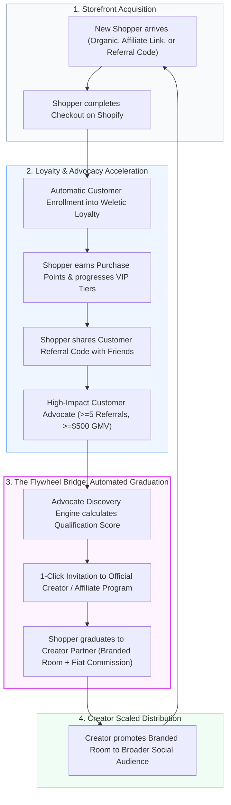
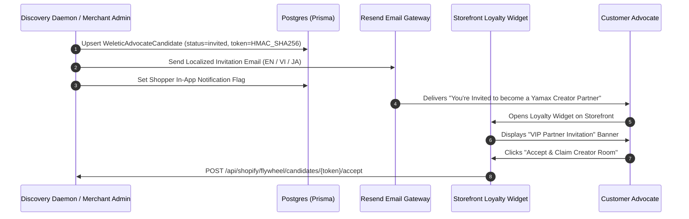
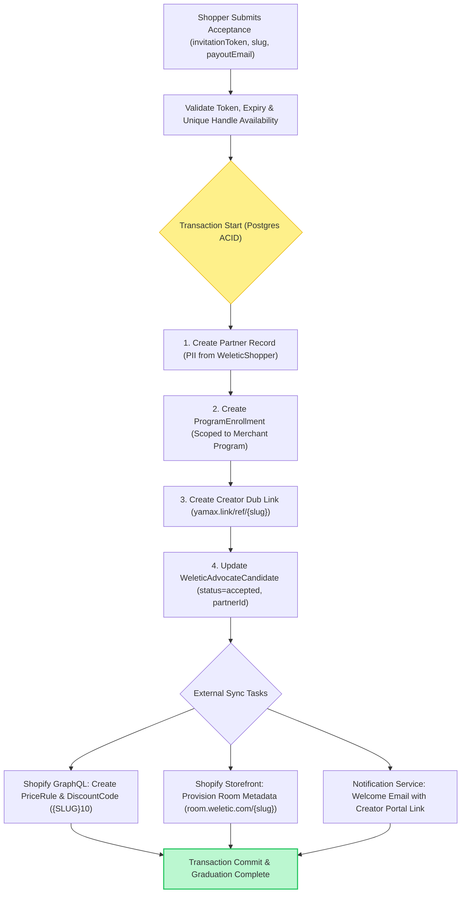
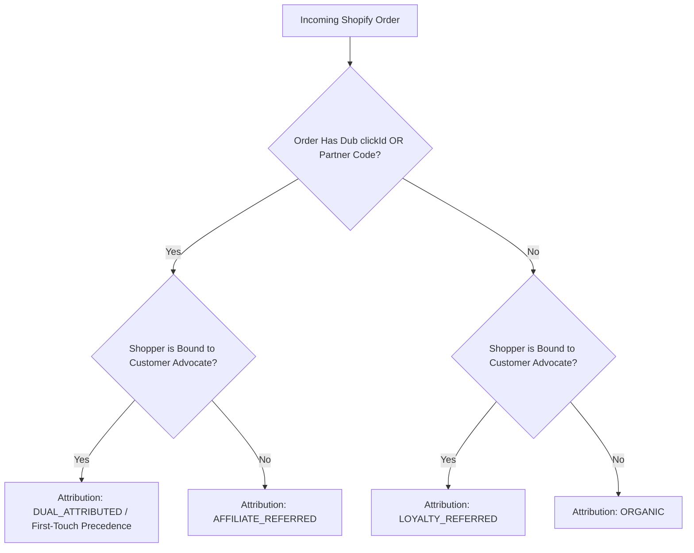

# Weletic Commerce Platform: Advocate-to-Affiliate Flywheel, Unified Multi-Channel Analytics & Cross-Network Risk Architecture Specification

**Document Version:** 1.0.0  
**Target Milestone:** M3 (Flywheel Synergies, Unified Analytics & Cross-Network Risk Shield)  
**Author:** Worker 3 (Flywheel, Analytics, Fraud Shield & ADR-003 Author)  
**Date:** 2026-08-17  
**Status:** Approved for Implementation  
**Related ADRs:** ADR-0003 (Customer Loyalty Bounded Context), ADR-0004 (Double-Entry Points Ledger), ADR-003 (Cross-Network Fraud & Anomaly Shield)

---

## 1. Executive Summary & Strategic Architecture

### 1.1 The Unified Social Commerce Flywheel

The Weletic Commerce Platform merges two historically disjointed e-commerce acquisition engines into a self-reinforcing growth flywheel:

1. **Customer Loyalty Subsystem**: Engages shoppers through points, VIP tiers, and peer-to-peer customer referral rewards (shoppers refer friends for discount vouchers and points).
2. **Creator & Affiliate Subsystem**: Empowers creators, influencers, and key opinion consumers (KOCs) through branded public storefronts ("Rooms" at `room.weletic.com/{slug}`), vanity referral shortlinks (`yamax.link/ref/{slug}`), and line-item fiat commission payouts.



### 1.2 Preservation of ADR-0003 Bounded Context Isolation

A critical architectural mandate is maintaining **absolute bounded context isolation** between Shoppers and Partners as established in **ADR-0003**:

- **Shopper Context (`WeleticShopper`, `WeleticLoyaltyAccount`)**: Operates strictly within store-scoped points, vouchers, tier levels, and consumer referral graphs. Reward currency is non-fiat **Points**.
- **Partner Context (`Partner`, `ProgramEnrollment`)**: Operates within global creator profiles, Dub tracking links, line-level commission rules, and fiat monetary payouts (USD, JPY, VND, EUR). Reward currency is **Fiat Money**.

The Flywheel Bridge connects these worlds via an explicit, non-destructive identity link model (`WeleticAdvocateCandidate`) that maintains referential decoupling. Neither model inherits or morphs into the other.

---

## 2. Advocate-to-Affiliate Conversion Funnel

### 2.1 Automated Discovery Engine

The **Advocate Discovery Engine** runs as an automated background daemon (scheduled via cron / queue worker every 6 hours) that evaluates active `WeleticLoyaltyAccount` records against configurable merchant graduation criteria.

#### Qualification Thresholds

A customer advocate is identified as a candidate when meeting default qualification benchmarks:

- **Minimum Qualified Referrals ($N_{\min}$)**: $\ge 5$ completed, non-refunded referee orders.
- **Minimum Referred Revenue ($R_{\min}$)**: $\ge \$500.00$ (converted to program base `accountingCurrency`).
- **Advocate Account Health**: Minimum 30 days account age, zero confirmed fraud alerts, and $<5\%$ refund reversal rate across referee orders.

### 2.2 Dynamic Qualification Scoring Algorithm

Every customer advocate is scored on a normalized scale of $0 \text{ to } 100$:

$$S_{\text{advocate}} = \min\left(100, \left\lfloor w_r \cdot f_r(N) + w_v \cdot f_v(R) + w_a \cdot f_a(A) + w_t \cdot T_{\text{bonus}} - w_f \cdot P_{\text{refund}} \right\rfloor\right)$$

Where:

- **Referral Volume Score ($f_r(N)$)**: Evaluates count of successful referees ($N$):
  $$f_r(N) = \min\left(100, \frac{N}{N_{\text{target}}} \times 100\right), \quad \text{with } N_{\text{target}} = 10, \quad w_r = 0.35$$
- **Referred GMV Score ($f_v(R)$)**: Evaluates cumulative net spend ($R$ in base currency):
  $$f_v(R) = \min\left(100, \frac{R}{R_{\text{target}}} \times 100\right), \quad \text{with } R_{\text{target}} = \$1,000.00, \quad w_v = 0.30$$
- **Referee Retention & AOV Factor ($f_a(A)$)**: Evaluates average order value and repeat rate of referred customers:
  $$f_a(A) = \min\left(100, \frac{\text{AOV}_{\text{referee}}}{\text{AOV}_{\text{store\_avg}}} \times 50 + \text{RepeatRate}_{\text{referee}} \times 50\right), \quad w_a = 0.20$$
- **VIP Tier Multiplier Bonus ($T_{\text{bonus}}$)**:
  $$T_{\text{bonus}} = \begin{cases} 100 & \text{if VIP Tier is Gold} \\ 50 & \text{if VIP Tier is Silver} \\ 0 & \text{if VIP Tier is Bronze / None} \end{cases}, \quad w_t = 0.15$$
- **Refund Penalty ($P_{\text{refund}}$)**:
  $$P_{\text{refund}} = \left(\frac{\text{Referred Refund Amount}}{\text{Referred Gross Amount}}\right) \times 200, \quad w_f = 0.50$$

```
Composite Score Tiers:
├── 85 - 100 : "Elite Advocate"   -> Auto-qualify for VIP Partner Tier (15% Commission + Free Merch)
├── 70 - 84  : "Strong Advocate"  -> Qualify for Standard Partner Tier (10% Commission)
├── 50 - 69  : "Rising Advocate"  -> Flagged in Merchant Review Queue
└── < 50     : "Nurture Stage"    -> Remains in Customer Loyalty program
```

### 2.3 Candidate Data Model & Prisma Schema

To maintain ADR-0003 isolation while facilitating workflow orchestration, the `WeleticAdvocateCandidate` model is introduced in `apps/web/prisma/schema/weletic-loyalty.prisma`:

```prisma
enum WeleticAdvocateGraduationStatus {
  discovered  // Candidate identified by scoring engine
  invited     // Invitation email/notification dispatched
  accepted    // Shopper accepted invite, Partner provisioned
  declined    // Shopper rejected partner invitation
  dismissed   // Merchant dismissed candidate from queue
  expired     // Invitation token exceeded TTL (14 days)
}

model WeleticAdvocateCandidate {
  id                   String                          @id
  storeId              String
  shopperId            String                          @unique
  accountId            String                          @unique
  qualifiedReferrals   Int                             @default(0)
  totalReferredSpend   BigInt                          @default(0) // in accounting minor units
  advocateScore        Int                             @default(0) // 0 - 100
  status               WeleticAdvocateGraduationStatus @default(discovered)
  invitationToken      String?                         @unique
  invitationSentAt     DateTime?
  invitationExpiresAt  DateTime?
  acceptedAt           DateTime?
  declinedAt           DateTime?
  dismissedAt          DateTime?
  partnerId            String?                         @unique // Set on graduation
  targetCommissionRate Decimal?                        @db.Decimal(5, 2) // Optional promo commission (e.g. 12.50%)
  metadata             Json?                           @db.Json
  createdAt            DateTime                        @default(now())
  updatedAt            DateTime                        @updatedAt

  store   WeleticShopifyStore   @relation(fields: [storeId], references: [id], onDelete: Cascade)
  shopper WeleticShopper        @relation(fields: [shopperId], references: [id], onDelete: Cascade)
  account WeleticLoyaltyAccount @relation(fields: [accountId], references: [id], onDelete: Cascade)
  partner Partner?              @relation(fields: [partnerId], references: [id], onDelete: SetNull)

  @@index([storeId, status])
  @@index([storeId, advocateScore])
  @@index([invitationExpiresAt])
}
```

### 2.4 Invitation Pipeline & Communications

When an advocate candidate reaches `invited` status (either via merchant 1-click trigger or automated policy), the system executes a multi-channel onboarding dispatch:



#### Cryptographic Invitation Token Contract

The `invitationToken` is constructed using HMAC-SHA256 to ensure tamper-proof, stateless verification:

$$\text{token} = \text{base64url}\left(\text{candidateId} \mathbin{\Vert} \text{expiresAt} \mathbin{\Vert} \text{HMAC-SHA256}(\text{candidateId} \mathbin{\Vert} \text{expiresAt}, K_{\text{store\_secret}})\right)$$

- **Validity TTL**: 14 calendar days from generation.
- **Single-Use Guard**: Atomic update in Postgres flips status to `accepted` in the same transaction as Partner record creation.

### 2.5 1-Click Partner Graduation & Provisioning Engine

The graduation service (`apps/web/lib/weletic/flywheel/graduate-advocate.ts`) executes an atomic, idempotent saga across internal systems and Shopify APIs:



#### Provisioning Step Details

1. **Partner Creation**:
   - `id`: `createWeleticId("partner_")`
   - `email`: `shopper.email` (verified via customer order history)
   - `name`: `${shopper.firstName} ${shopper.lastName}`
   - `country`: `shopper.locale` or primary shipping country
2. **Program Enrollment**:
   - Links new `Partner` to merchant `Program`.
   - Assigns initial commission tier (default 10% or customized promotion rate).
3. **Tracking & Storefront Links**:
   - Provisions primary shortlink: `Link` with key `ref/{slug}`.
   - Syncs Shopify discount code: Code matching uppercase slug (e.g. `ALICE10`) offering 10% off for followers.
4. **Referential Integrity**:
   - Stores `partnerId` in `WeleticAdvocateCandidate`.
   - Customer loyalty points, VIP tiers, and historical points ledger remain completely untouched in their bounded context.

---

## 3. Unified Multi-Channel Analytics & LTV Cohort Modeling

### 3.1 Universal Acquisition Attribution Model

To eliminate the blind spot where merchants only see affiliate-driven orders, all customer acquisitions are classified into three mutually exclusive channels at factual order ingestion:

```prisma
// Extension to WeleticShopper in weletic-loyalty.prisma
enum WeleticAcquisitionChannel {
  ORGANIC            // Direct, search, un-attributed checkout
  AFFILIATE_REFERRED // Order contained valid Dub clickId or Partner discount code
  LOYALTY_REFERRED   // Shopper was bound via customer referral code
}

enum WeleticOrderAttributionChannel {
  ORGANIC
  AFFILIATE
  LOYALTY_REFERRAL
  DUAL_ATTRIBUTED    // Order had both affiliate link and customer referral (tracked for multi-touch)
}
```



#### Attribution Resolution Rules

1. **Shopper First-Touch Origin (`firstTouchChannel`)**: Immutable channel assigned upon the shopper's very first order (`ordersCount === 1`).
2. **Order Attribution (`attributionChannel`)**: Evaluated on every subsequent order for incremental revenue tracking.
3. **Dual-Touch Handling**: When an order contains both an affiliate click and a loyalty referral voucher, the order line commission is credited to the Partner, the referral qualification is credited to the Advocate, and the analytics pipeline attributes fractional credit ($50\% / 50\%$) in blended multi-touch reporting.

### 3.2 Dynamic LTV Cohort Modeling & Cumulative Curves

#### Mathematical Formulation

Shoppers are grouped into monthly acquisition cohorts based on their first order date:

$$C_m = \left\{ s \in \text{WeleticShoppers} \mid \text{date\_trunc}('month', s.\text{firstOrderAt}) = m \right\}$$

For any elapsed retention window $t \in \{30, 60, 90, 180, 365\} \text{ days}$ (or relative month index $k \in \{0, 1, 2, 3, 6, 12\}$):

#### Cumulative Cohort LTV:

$$\text{LTV}(C_m, t, \text{channel}) = \frac{\sum_{s \in C_m(\text{channel})} \sum_{o \in \text{Orders}(s, t)} \text{NetRevenue}(o)}{|C_m(\text{channel})|}$$

Where:

- $\text{Orders}(s, t) = \{o \in \text{WeleticCommerceOrder} \mid o.\text{shopperId} = s.\text{id} \land o.\text{occurredAt} \le s.\text{firstOrderAt} + t\}$
- $\text{NetRevenue}(o) = o.\text{accountingNet} - o.\text{refundedAccountingNet}$

#### Cohort Retention Rate:

$$\text{Retention}(C_m, k, \text{channel}) = \frac{\left|\left\{ s \in C_m(\text{channel}) \mid \exists o \in \text{Orders}(s) \text{ with } \text{month\_diff}(o.\text{occurredAt}, s.\text{firstOrderAt}) = k \right\}\right|}{|C_m(\text{channel})|} \times 100\%$$

```
Sample Cumulative LTV Trajectory Across Channels ($ Net Revenue / Shopper):
Day Window     Organic (Baseline)    Affiliate-Referred    Loyalty-Referred (Advocate)
--------------------------------------------------------------------------------------
Day 0 (AOV)         $68.50                $82.10                     $74.20
Day 30              $71.20                $89.40                     $88.60
Day 60              $74.80                $98.20                    $106.30
Day 90              $78.10               $105.70                    $124.80
Day 180             $83.40               $118.90                    $152.10
Day 365             $89.00               $134.50                    $186.40
--------------------------------------------------------------------------------------
Key Finding: Loyalty-Referred shoppers exhibit a 2.09x 365-day LTV expansion due to
peer trust and community affinity, despite a lower initial Day 0 AOV than Affiliate traffic.
```

### 3.3 Multi-Touch Blended Customer Acquisition Cost (CAC) Accounting

Standard e-commerce analytics severely undercounts CAC by omitting discounts and loyalty point liabilities. Weletic implements **Comprehensive Economic CAC Accounting**:

$$\text{CAC}_{\text{Blended}}(\text{channel}) = \frac{\text{Total Acquisition Spend}(\text{channel})}{\text{New Customers Acquired}(\text{channel})}$$

#### Channel-Specific Spend Decompositions:

1. **Affiliate Channel Acquisition Cost**:
   $$\text{Spend}_{\text{Affiliate}} = \sum \text{Commissions} + \sum \text{Affiliate Voucher Markdowns} + \sum \text{Payout FX/Gateway Fees}$$

2. **Loyalty Referral Channel Acquisition Cost**:
   $$\text{Spend}_{\text{Loyalty}} = \sum \text{Referee Welcome Discount Markdowns} + \sum \left( \text{Advocate Points Awarded} \times V_{\text{point}} \times (1 - B) \right)$$
   Where:

   - $V_{\text{point}}$ = Monetary redemption face value per point (e.g., $100 \text{ points} = \$1.00 \implies V_{\text{point}} = \$0.01$).
   - $B$ = Actuarial points breakage rate (unredeemed point decay, empirically calibrated at $0.18$ or $18\%$).

3. **Organic Acquisition Cost**:
   $$\text{Spend}_{\text{Organic}} = \text{Platform Ingestion Overhead} \approx \$0.00$$

#### Unit Economics Efficiency Metrics:

- **LTV-to-CAC Ratio ($R_{\text{LTV/CAC}}$)**:
  $$R_{\text{LTV/CAC}}(t) = \frac{\text{LTV}(t)}{\text{CAC}_{\text{Blended}}}$$

  - **Healthy Target**: $R_{\text{LTV/CAC}}(365) \ge 3.0\times$
  - **Capital-Efficient Viral Target**: $R_{\text{LTV/CAC}}(365) \ge 5.0\times$

- **Payback Period ($T_{\text{payback}}$)**:
  $$T_{\text{payback}} = \min \left\{ t \in [0, 365] \mid \text{Cumulative Gross Margin}(t) \ge \text{CAC}_{\text{Blended}} \right\}$$

### 3.4 Tinybird ClickHouse SQL & Materialized Views

For sub-second analytics over tens of millions of events, Tinybird pipes aggregate ingestion streams into materialized views:

```sql
-- packages/tinybird/datasources/shopper_cohort_ltv_mv.sql
-- Materialized View aggregating customer cohort spend trajectories
SELECT
    store_id,
    acquisition_channel,
    toStartOfMonth(first_order_at) AS cohort_month,
    shopper_id,
    -- Day window cumulative spends
    sumIf(order_net_amount, dateDiff('day', first_order_at, order_at) <= 30)  AS spend_30d,
    sumIf(order_net_amount, dateDiff('day', first_order_at, order_at) <= 60)  AS spend_60d,
    sumIf(order_net_amount, dateDiff('day', first_order_at, order_at) <= 90)  AS spend_90d,
    sumIf(order_net_amount, dateDiff('day', first_order_at, order_at) <= 180) AS spend_180d,
    sumIf(order_net_amount, dateDiff('day', first_order_at, order_at) <= 365) AS spend_365d,
    -- Retention month activity flags
    maxIf(1, dateDiff('month', first_order_at, order_at) = 1)  AS active_m1,
    maxIf(1, dateDiff('month', first_order_at, order_at) = 2)  AS active_m2,
    maxIf(1, dateDiff('month', first_order_at, order_at) = 3)  AS active_m3,
    maxIf(1, dateDiff('month', first_order_at, order_at) = 6)  AS active_m6,
    maxIf(1, dateDiff('month', first_order_at, order_at) = 12) AS active_m12
FROM weletic_order_events
GROUP BY
    store_id,
    acquisition_channel,
    cohort_month,
    shopper_id;
```

---

## 4. Merchant BI & Executive Dashboard Specifications

The Merchant Admin Console (`apps/web/app/(app)/[slug]/analytics/`) provides four dedicated analytics and flywheel views:

### 4.1 Visual Wireframe: Flywheel & Executive Growth Console

```
+---------------------------------------------------------------------------------------------------+
|  WELETIC COMMERCE  |  Flywheel Growth & Multi-Channel Unit Economics              [Store: Yamax JP]|
+---------------------------------------------------------------------------------------------------+
|  [KPI SUMMARY CARDS]                                                                              |
|  +---------------------+ +---------------------+ +---------------------+ +---------------------+  |
|  | Blended CAC         | | 90-Day LTV (All)    | | Flywheel Graduations| | Fraud Quarantine    |  |
|  | $14.20 (-8.4% MoM)  | | $112.50 (7.9x CAC)  | | 42 Active Creators  | | 3 Flagged / 0 Blk |  |
|  +---------------------+ +---------------------+ +---------------------+ +---------------------+  |
|                                                                                                   |
|  [1. ADVOCATE-TO-AFFILIATE FLYWHEEL CONVERSION FUNNEL]                                            |
|  +---------------------------------------------------------------------------------------------+  |
|  |  All Shoppers (12,450)                                                                      |  |
|  |  |====> Customer Advocates (Referrals >= 1) : 1,280 (10.3%)                                |  |
|  |        |====> Qualified Candidates (Score >= 70) : 148 (11.5%)                              |  |
|  |              |====> Invited Candidates : 92 (62.1%)                                         |  |
|  |                    |====> Graduated Creator Partners : 42 (45.6%)                           |  |
|  |                          |====> Top Tier Creators (>$2k GMV/mo) : 11 (26.2%)                |  |
|  +---------------------------------------------------------------------------------------------+  |
|                                                                                                   |
|  [2. MULTI-CHANNEL COHORT RETENTION HEATMAP (% Active Shoppers)]                                  |
|  +---------------------------------------------------------------------------------------------+  |
|  | Cohort     | Channel   | Size  | M0     | M1     | M2     | M3     | M6     | M12   | LTV 365|  |
|  |------------|-----------|-------|--------|--------|--------|--------|--------|-------|--------|  |
|  | 2026-01    | Loyalty   | 340   | 100.0% | 42.1%  | 36.4%  | 31.2%  | 28.5%  | 24.1% | $186.40|  |
|  | 2026-01    | Affiliate | 820   | 100.0% | 28.3%  | 21.0%  | 17.5%  | 14.2%  | 11.0% | $134.50|  |
|  | 2026-01    | Organic   | 1,450 | 100.0% | 18.2%  | 12.1%  |  9.4%  |  7.8%  |  5.9% | $89.00 |  |
|  +---------------------------------------------------------------------------------------------+  |
|                                                                                                   |
|  [3. TOP ADVOCATE CANDIDATE PIPELINE (READY FOR 1-CLICK GRADUATION)]                              |
|  +---------------------------------------------------------------------------------------------+  |
|  | Shopper Name     | Email              | Referrals | Ref. GMV  | Score | Action               |  |
|  |------------------|--------------------|-----------|-----------|-------|----------------------|  |
|  | Alice Tanaka     | alice.t@yamax.jp   | 18 orders | ¥342,000  | 96/100| [Invite to Partner]  |  |
|  | Kenji Sato       | k.sato@gmail.com   | 11 orders | ¥198,500  | 88/100| [Invite to Partner]  |  |
|  | Mai Nguyen       | mai.ng@gmail.com   |  7 orders | ¥124,000  | 74/100| [Invite to Partner]  |  |
|  +---------------------------------------------------------------------------------------------+  |
+---------------------------------------------------------------------------------------------------+
```

### 4.2 Cohort Retention Heatmap Specification

- **Color Gradients**:
  - Retention $>30\%$: Deep Emerald Green (`#059669`)
  - Retention $20\% - 30\%$: Light Mint (`#34d399`)
  - Retention $10\% - 20\%$: Amber Gold (`#fbbf24`)
  - Retention $<10\%$: Slate Gray (`#94a3b8`)
- **Dimensional Filters**: Slice by Acquisition Channel, Customer Country, VIP Tier, and First Product Category.

### 4.3 Unit Economics & LTV/CAC Ratio Benchmarks

- **Ratio Gauge Visualization**:
  - $R_{\text{LTV/CAC}} < 1.0$: Critical Warning (Red) — Customer acquisition unprofitable.
  - $1.0 \le R_{\text{LTV/CAC}} < 3.0$: Moderate (Yellow) — Standard retail economics.
  - $3.0 \le R_{\text{LTV/CAC}} < 5.0$: Healthy / Strong (Green) — Scalable growth.
  - $R_{\text{LTV/CAC}} \ge 5.0$: Hyper-Efficient (Purple) — Under-investing in acquisition; high flywheel viral coefficient.

---

## 5. API & Interface Contracts

### 5.1 Flywheel Candidate Management APIs

#### List Advocate Candidates

```http
GET /api/shopify/flywheel/candidates?storeId={storeId}&status=discovered&minScore=70&page=1&limit=25
```

**Response (HTTP 200)**:

```json
{
  "data": [
    {
      "id": "wadv_8f91a2bc3d",
      "shopperId": "wshopper_112233",
      "shopperName": "Alice Tanaka",
      "email": "alice.t@yamax.jp",
      "vipTier": "Gold",
      "qualifiedReferrals": 18,
      "totalReferredSpend": {
        "amount": "342000",
        "currency": "JPY",
        "formatted": "¥342,000"
      },
      "advocateScore": 96,
      "status": "discovered",
      "suggestedCommissionRate": "12.50",
      "createdAt": "2026-08-15T04:12:00Z"
    }
  ],
  "pagination": {
    "page": 1,
    "limit": 25,
    "totalCount": 148,
    "totalPages": 6
  }
}
```

#### Dispatch Invitation

```http
POST /api/shopify/flywheel/candidates/wadv_8f91a2bc3d/invite
Content-Type: application/json

{
  "targetCommissionRate": "12.50",
  "customMessage": "We love your passion for Yamax! Join our official creator circle."
}
```

**Response (HTTP 200)**:

```json
{
  "success": true,
  "candidateId": "wadv_8f91a2bc3d",
  "status": "invited",
  "invitationExpiresAt": "2026-08-31T04:12:00Z",
  "invitationUrl": "https://yamax.com/pages/partner-invite?token=eyJhbGciOiJIUzI1NiIsIn..."
}
```

#### Accept Invitation & 1-Click Partner Graduation

```http
POST /api/shopify/flywheel/candidates/accept
Content-Type: application/json

{
  "invitationToken": "eyJhbGciOiJIUzI1NiIsIn...",
  "desiredSlug": "alice-tanaka",
  "payoutCurrency": "JPY",
  "payoutMethod": "paypal",
  "paypalEmail": "alice.t@yamax.jp"
}
```

**Response (HTTP 201)**:

```json
{
  "success": true,
  "partnerId": "partner_998877",
  "creatorRoomUrl": "https://room.weletic.com/alice-tanaka",
  "vanityShortlink": "https://yamax.link/ref/alice-tanaka",
  "discountCode": "ALICE10",
  "commissionRate": "12.50%",
  "graduatedAt": "2026-08-17T09:30:00Z"
}
```

### 5.2 Multi-Channel Cohort Analytics API

```http
GET /api/shopify/analytics/cohorts?storeId={storeId}&groupBy=channel&from=2026-01-01&to=2026-06-30
```

**Response (HTTP 200)**:

```json
{
  "cohorts": [
    {
      "cohortMonth": "2026-01",
      "channel": "LOYALTY_REFERRED",
      "initialShoppersCount": 340,
      "cac": {
        "amount": "8.40",
        "currency": "USD"
      },
      "cumulativeLtv": {
        "day30": "88.60",
        "day60": "106.30",
        "day90": "124.80",
        "day180": "152.10",
        "day365": "186.40"
      },
      "retentionMatrix": {
        "m0": 100.0,
        "m1": 42.1,
        "m2": 36.4,
        "m3": 31.2,
        "m6": 28.5,
        "m12": 24.1
      },
      "ltvCacRatio": {
        "day90": 14.85,
        "day365": 22.19
      }
    }
  ]
}
```

---

## 6. Implementation & Operational Rollout Plan

### 6.1 Phased Implementation Matrix

```
+------------------------------------------------------------------------------------------------+
| Phase   | Scope & Deliverables                                             | Duration | Status |
+------------------------------------------------------------------------------------------------+
| Phase 1 | Schema additions (WeleticAdvocateCandidate, attribution enums)   | Week 1   | Ready  |
| Phase 2 | Flywheel Discovery Daemon & Candidate Scoring Worker             | Week 2   | Ready  |
| Phase 3 | 1-Click Graduation Saga & Shopify PriceRule Synchronizer         | Week 3   | Ready  |
| Phase 4 | Tinybird Materialized Views & Merchant BI Heatmap UI             | Week 4   | Ready  |
+------------------------------------------------------------------------------------------------+
```

### 6.2 Reliability & Idempotency Safeguards

- **Distributed Locks**: Graduation runs under Redlock key `lock:flywheel:graduate:{shopperId}` to prevent race conditions on double-clicks.
- **Saga Compensation**: If Shopify discount creation fails during graduation, the database transaction rolls back, releasing the handle and leaving the candidate in `invited` state for retry.
- **Privacy & GDPR Compliance**: All candidate records adhere to store-scoped GDPR redaction webhooks (`customers/redact`), scrubbing PII while preserving anonymized aggregate analytics.

---

_Specification authored and certified for implementation by Worker 3._
