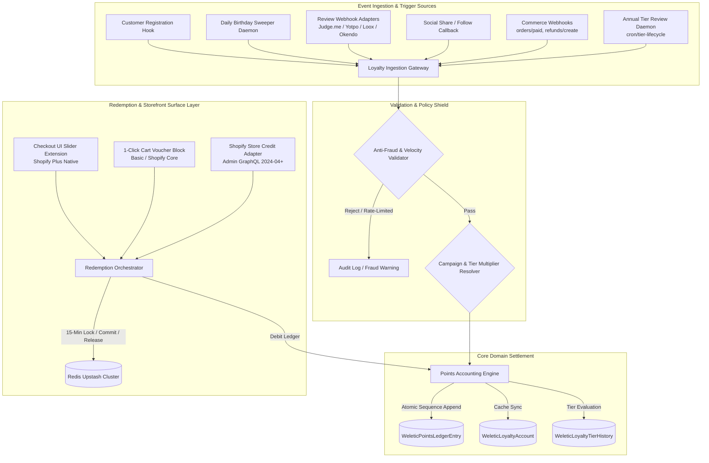
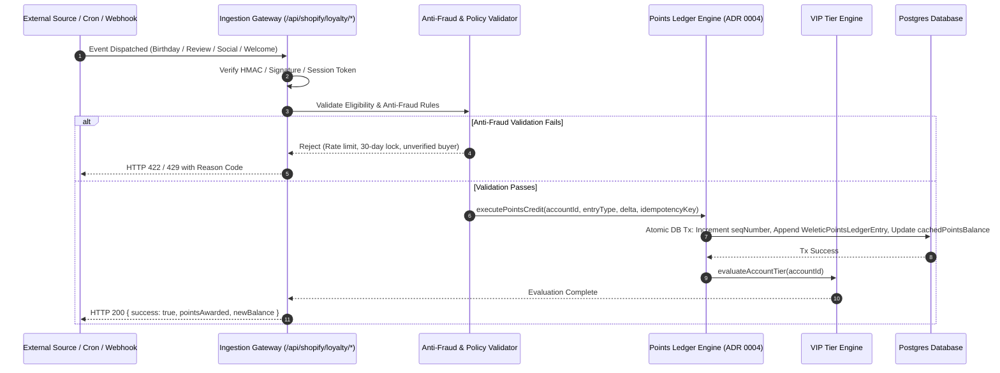
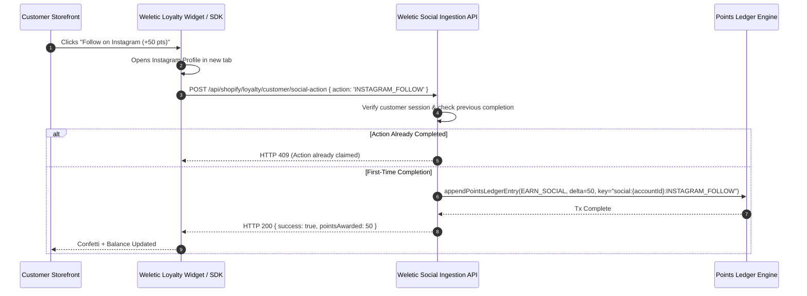
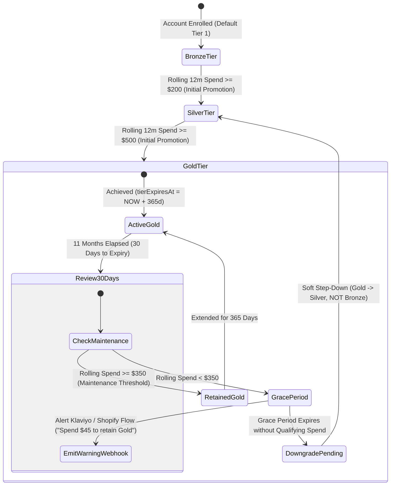
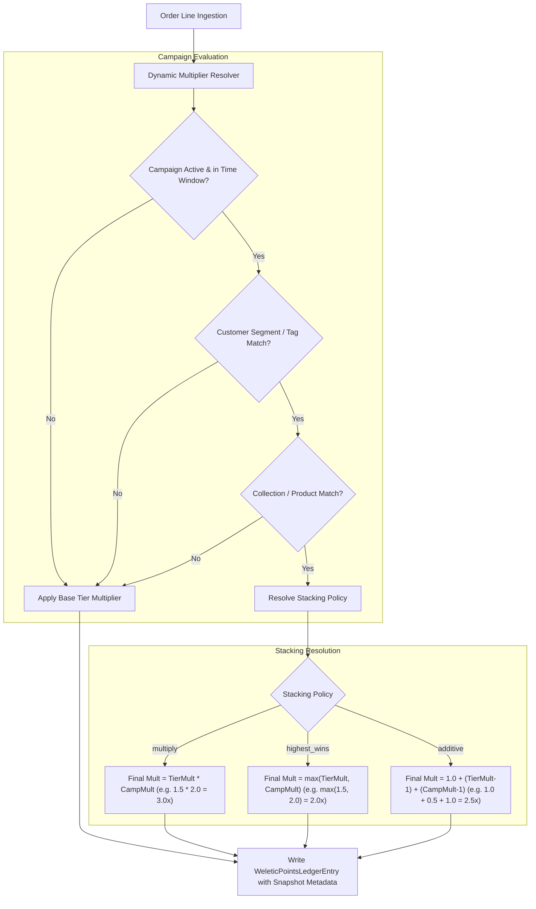
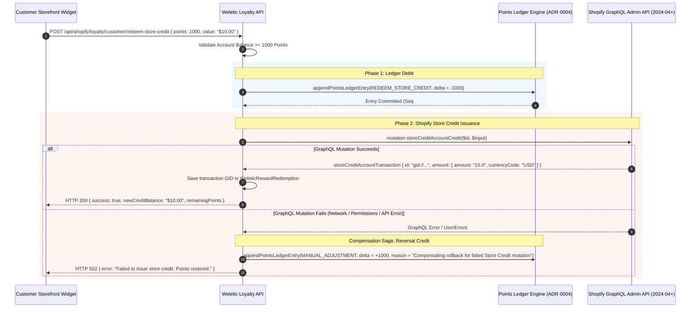

# Weletic Customer Loyalty Deepening & Feature Architecture Specification (Requirement R1)

**Historical planning artifact — superseded and non-authoritative.** This
document mixes implemented behavior with proposed Shopify Plus, store-credit,
review-provider, social, notification, and infrastructure work. Do not use it
to determine current capability or rollout readiness. Use
`docs/loyalty/capability-matrix.md`, `docs/loyalty/ARCHITECTURE.md`, and the
staged rollout runbooks as the operational sources of truth.

- **Document Version:** 1.0.0
- **Status:** Superseded historical proposal; not an implementation-status document
- **Author:** Worker 1 (Loyalty Deepening & ADR-001 Author)
- **Target Audience:** Core Engineering, Platform Architects, Quality Assurance, Security Auditors
- **Related ADRs:** ADR 0003 (Bounded Context Isolation), ADR 0004 (Double-Entry Points Ledger), ADR 0005 (Two-Phase Historical Backfill), ADR 0008 (Security Boundary), ADR-001 (Shopify Plus Checkout UI Extension)

---

## 1. Executive Summary & Architectural Positioning

The Weletic Customer Loyalty platform provides multi-tenant, store-scoped loyalty, VIP tier progression, and customer referral mechanisms integrated natively with Shopify. Built upon the foundational bounded context isolation principles established in **ADR 0003**, the loyalty engine maintains absolute database and service separation from the Weletic Affiliate/Creator commission engine. All points transactions are immutably recorded in a double-entry, monotonic append-only ledger (**ADR 0004**), ensuring total financial auditability, deterministic balance projections, and exact proportional clawbacks during refunds.

This specification details the **Requirement R1 (Customer Loyalty Deepening & Feature Roadmap)** expansion, defining four mission-critical subsystems:

1. **Non-Order Earning Triggers**: Automated event-driven and scheduled reward engines for customer birthdays, third-party product reviews (Judge.me, Yotpo, Loox, Okendo), social share actions, and account creation welcome bonuses.
2. **VIP Tier Lifecycle & Retention Engine**: Rolling 12-month spend tracking, maintenance thresholds, an automated annual tier review daemon (`cron/tier-lifecycle`), a 30-day soft-downgrade grace period with merchant alert webhooks, and graceful single-tier step-downs.
3. **Dynamic Campaign Multipliers & Rules Engine**: Time-windowed promotional campaigns (`WeleticLoyaltyCampaign`), customer segment targeting via Shopify tags/RFM cohorts, product/collection inclusions/exclusions, and deterministic multiplier stacking policies.
4. **Shopify Store Credit API Adapter**: Native integration with the Shopify GraphQL Admin API (`2024-04`+) Store Credit system (`storeCreditAccountCredit`), enabling point-to-credit conversions that stack seamlessly with promotional discount codes across online checkouts, Shop Pay, and Shopify POS.

---

## 2. High-Level Subsystem Architecture



---

## 3. Non-Order Earning Triggers

While transaction-based earning rewards transactional velocity, non-order earning triggers drive continuous lifestyle engagement, higher retention, and organic customer acquisition.



### 3.1 Customer Birthday Rewards

#### Functional Requirement

Merchants award bonus points on a customer's birthday to drive annual delight and re-engagement.

#### Anti-Fraud & Abuse Prevention Rules

1. **30-Day Anti-Gaming Lockout**: If a customer registers or modifies their birthday within 30 days of the specified birthday, the points grant for the current calendar year is deferred to the subsequent year. This eliminates "sign up today with today's birthday to get instant free points" exploits.
2. **Mutation Rate Limit**: A customer can set or update their birthday at most **once every 365 days**.
3. **Identity Verification**: Birthdays can only be registered by authenticated Shopify customer sessions (via Shopify App Proxy or authenticated Storefront JWT).
4. **Idempotency Guarantee**: Points are granted once per calendar year using the deterministic idempotency key format:
   $$\text{idempotencyKey} = \text{`birthday:\{storeId\}:\{accountId\}:\{YYYY\}`}$$

#### Schema Additions

In `WeleticShopper`:

```prisma
model WeleticShopper {
  // Existing fields...
  birthMonth        Int?      // 1-12
  birthDay          Int?      // 1-31
  birthYear         Int?      // Optional: year of birth
  birthdayUpdatedAt DateTime? // Timestamp of last modification
}
```

#### Nightly Sweeper Daemon (`/api/cron/loyalty/birthdays`)

- **Execution Schedule**: Daily at 00:05 UTC.
- **Timezone Normalization**: The sweeper partitions accounts by the store's primary timezone (`WeleticShopifyStore.timezone`). It matches customers whose `birthMonth` and `birthDay` match today's date in their respective store's local time.
- **Batch Processing Algorithm**:

  ```typescript
  export async function sweepBirthdayRewards(
    storeId: string,
    targetDate: Date,
  ) {
    const month = targetDate.getUTCMonth() + 1;
    const day = targetDate.getUTCDate();
    const currentYear = targetDate.getUTCFullYear();

    const eligibleShoppers = await prisma.weleticShopper.findMany({
      where: {
        storeId,
        birthMonth: month,
        birthDay: day,
        loyaltyAccount: { status: "active" },
        OR: [
          { birthdayUpdatedAt: null },
          { birthdayUpdatedAt: { lte: subDays(targetDate, 30) } },
        ],
      },
      include: { loyaltyAccount: true },
    });

    for (const shopper of eligibleShoppers) {
      if (!shopper.loyaltyAccount) continue;
      const idempotencyKey = `birthday:${storeId}:${shopper.loyaltyAccount.id}:${currentYear}`;

      await appendPointsLedgerEntry({
        storeId,
        accountId: shopper.loyaltyAccount.id,
        entryType: WeleticPointsLedgerEntryType.EARN_BIRTHDAY,
        pointsDelta: program.birthdayRewardPoints,
        idempotencyKey,
        reason: `Happy Birthday ${currentYear} Reward`,
        metadata: { birthMonth: month, birthDay: day, year: currentYear },
      });
    }
  }
  ```

---

### 3.2 Product Review Integration Engine

#### Supported Review Providers

- **Judge.me** (Webhook: `review/created`, `review/updated`)
- **Yotpo** (Webhook: `review_created`)
- **Loox** (Webhook: `review.created`)
- **Okendo** (Webhook: `review_submitted`)
- **Shopify Native Product Reviews** (Metaobject / Event webhook)

#### Unified Ingestion Endpoint

`POST /api/shopify/loyalty/webhooks/review/:provider`

#### Provider Verification & Signature Authentication

Each incoming webhook is authenticated using provider-specific HMAC signatures:

- **Judge.me**: HMAC-SHA256 of raw body with Judge.me API Secret Token in `X-JudgeMe-Signature`.
- **Yotpo**: HMAC-SHA256 with Yotpo App Secret in `X-Yotpo-Signature`.
- **Loox**: Webhook token matching in query/header parameters.
- **Okendo**: Shared secret HMAC header `X-Okendo-Signature`.

#### Review Verification Pipeline & Tiered Reward Matrix

1. **Shopper Lookup**: Resolves reviewer email against `WeleticShopper` for the target `storeId`.
2. **Verified Buyer Check**: Verifies if the review payload contains `verified_buyer === true` OR queries `WeleticCommerceOrder` to confirm the customer previously bought the reviewed `shopifyProductId`.
3. **Reward Tier Grading**:
   - Standard Text Review ($\ge 20$ characters): Base Reward (e.g., 50 points).
   - Review with Photo: Base Reward + Photo Bonus (e.g., 50 + 50 = 100 points).
   - Review with Video: Base Reward + Video Bonus (e.g., 50 + 100 = 150 points).
4. **Velocity & Anti-Spam Limits**:
   - Maximum **2 review rewards** per customer per calendar month.
   - Minimum character length threshold (default: 20 characters).
   - Instant disqualification if rating $\le 0$ or flagged as spam by provider.
5. **Ledger Execution**:
   - `entryType`: `EARN_REVIEW`
   - `idempotencyKey`: `review:{provider}:{storeId}:{reviewId}`
   - `metadata`: `{ provider, reviewId, productId, rating, hasPhoto, hasVideo, verifiedBuyer: true }`

---

### 3.3 Social Share & Engagement Actions

#### Supported Social Channels & Actions

- **Instagram**: Follow brand account (`INSTAGRAM_FOLLOW`).
- **TikTok**: Follow brand profile (`TIKTOK_FOLLOW`).
- **X (Twitter)**: Share store/product referral link (`X_SHARE`).
- **Facebook**: Like/Follow brand page (`FACEBOOK_LIKE`).
- **YouTube**: Subscribe to brand channel (`YOUTUBE_SUBSCRIBE`).

#### Storefront Callback Flow



#### Abuse Prevention & Enforcement

- Strictly **one reward per social action per customer account**.
- Backend enforcement key: `idempotencyKey = "social:{storeId}:{accountId}:{actionType}"`.
- Optional integration with server-side OAuth callbacks (Meta Graph API / X API v2) for enterprise merchants requiring deterministic follow verification.

---

### 3.4 Account Creation Welcome Bonus

#### Auto-Enrollment Integration

When an unauthenticated guest creates an account or an authenticated customer places their first order, `upsertWeleticShopper` auto-provisions a `WeleticLoyaltyAccount`.

- If `WeleticLoyaltyProgram.welcomeBonusPoints > 0`, the system automatically invokes the ledger engine.
- `entryType`: `EARN_WELCOME`.
- `idempotencyKey`: `welcome:${storeId}:${accountId}`.
- Prevents duplicate bonuses across account updates or re-enrollment events.

---

## 4. VIP Tier Lifecycle & Retention Engine

VIP tiers drive aspirational purchasing behavior. However, static tiers create permanent liabilities and fail to incentivize annual repurchasing. The Weletic Retention Engine implements a dynamic 12-month rolling tier lifecycle with churn-mitigating maintenance thresholds and soft-downgrade step-downs.



### 4.1 Rolling 12-Month Spend Metric & Accounting

#### Calculation Formula

Tier qualification is computed over a sliding 365-day rolling window:
$$\text{tierSpendRolling12Months} = \sum_{k=1}^{n} \text{EligibleNetSubtotal}(O_k) \quad \forall O_k \text{ where } \text{createdAt}(O_k) \ge (\text{NOW}() - 365\text{ days})$$

- **Eligible Net Subtotal**: Order subtotal in minor currency units after line discounts, excluding taxes, shipping, and refunded amounts.
- **Incremental Real-Time Maintenance**:
  - `orders/paid`: Adds eligible net amount to `tierSpendRolling12Months`.
  - `refunds/create`: Deducts exact proportional refund amount from `tierSpendRolling12Months`.
  - Scheduled Daemon: Daily sweeper decrements orders aging past day 365.

---

### 4.2 Promotion Thresholds vs Maintenance Thresholds

To prevent churn friction and reward ongoing loyalty without punitive barriers, tier retention utilizes a bifurcated threshold model:

| VIP Tier      | Tier Order | Initial Promotion Threshold (Rolling 12m) | Annual Maintenance Threshold (Retention) | Earn Multiplier | Entry Welcome Bonus |
| :------------ | :--------: | :---------------------------------------: | :--------------------------------------: | :-------------: | :-----------------: |
| **Bronze**    |     1      |                   $0.00                   |                  $0.00                   |      1.00x      |      0 Points       |
| **Silver**    |     2      |                  $200.00                  |           $150.00 (25% lower)            |      1.25x      |     100 Points      |
| **Gold**      |     3      |                  $500.00                  |           $350.00 (30% lower)            |      1.50x      |     250 Points      |
| **VIP Elite** |     4      |                 $1,200.00                 |           $850.00 (29% lower)            |      2.00x      |     500 Points      |

#### Schema Support in `WeleticLoyaltyTier`

```prisma
model WeleticLoyaltyTier {
  // Existing fields...
  maintenanceSpendThreshold  BigInt @default(0) // Spend required in 12m to retain tier
  maintenancePointsThreshold BigInt @default(0) // Points required in 12m to retain tier
}

model WeleticLoyaltyAccount {
  // Existing fields...
  tierAchievedAt        DateTime?
  tierGracePeriodEndsAt DateTime?
}
```

---

### 4.3 Annual Tier Review Sweeper Daemon (`/api/cron/loyalty/tier-lifecycle`)

- **Cron Schedule**: Nightly at 01:00 UTC.
- **Execution Pipeline**:
  1. **Query At-Risk Accounts**: Selects accounts where `currentTier.tierOrder > 1` AND `tierExpiresAt <= NOW() + 30 days`.
  2. **30-Day Warning Phase**: If `tierExpiresAt <= NOW() + 30 days` and `tierExpiresAt > NOW()`:
     - Calculates spend shortfall:
       $$\text{shortfall} = \max(0, \text{tier.maintenanceSpendThreshold} - \text{account.tierSpendRolling12Months})$$
     - If $\text{shortfall} > 0$, emits event `loyalty.tier_retention_warning` to configured webhook endpoints (e.g. Klaviyo, Omnisend, Shopify Flow) with payload:
       ```json
       {
         "eventType": "loyalty.tier_retention_warning",
         "storeId": "store_123",
         "customerId": "cust_456",
         "currentTier": "Gold",
         "daysRemaining": 30,
         "shortfallMinorUnits": 4500,
         "currency": "USD",
         "targetMaintenanceSpendMinorUnits": 35000,
         "currentRollingSpendMinorUnits": 30500,
         "tierExpiresAt": "2026-09-17T01:00:00Z"
       }
       ```
  3. **Maturity Evaluation Phase (`tierExpiresAt <= NOW()`):**
     - Case A (Maintenance Met): If $\text{tierSpendRolling12Months} \ge \text{maintenanceSpendThreshold}$:
       - Updates `tierExpiresAt = tierExpiresAt + 365 days`.
       - Logs `WeleticLoyaltyTierHistory` with `changeReason = "threshold_reached"`, `notes = "Annual tier review: maintenance spend satisfied"`.
     - Case B (Maintenance Failed $\rightarrow$ Soft Downgrade):
       - If `tierGracePeriodEndsAt == null`: Set `tierGracePeriodEndsAt = NOW() + 30 days` and notify merchant/customer.
       - If `tierGracePeriodEndsAt <= NOW()`: Execute **Step-Down Downgrade**.

---

### 4.4 Soft-Downgrade Step-Down Mechanics

A customer who achieves VIP Elite ($1,200 threshold) but has a slow year should **never** be immediately dropped to Bronze ($0). Hard demotions cause high brand resentment and customer churn.

#### Step-Down Algorithm:

1. Identify the immediate previous tier in the hierarchy:
   $$\text{nextLowerTierOrder} = \text{currentTier.tierOrder} - 1$$
2. Transition account to `nextLowerTierOrder` (e.g. Tier 4 Elite $\rightarrow$ Tier 3 Gold; Tier 3 Gold $\rightarrow$ Tier 2 Silver).
3. Reset `tierExpiresAt = NOW() + 365 days`.
4. Clear `tierGracePeriodEndsAt = null`.
5. Log `WeleticLoyaltyTierHistory`:
   - `fromTierId`: `oldTier.id`
   - `toTierId`: `newTier.id`
   - `changeReason`: `WeleticLoyaltyTierChangeReason.annual_downgrade`
   - `notes`: `Soft-downgrade step-down from ${oldTier.name} to ${newTier.name} following grace period expiry.`

---

## 5. Dynamic Campaign Multipliers & Rule Engine

To drive promotional revenue spikes (e.g., "Double Points Weekend", "3x Points on Yenergy Leggings"), the loyalty platform provides a declarative campaign multiplier engine.



### 5.1 Campaign Entity Schema (`WeleticLoyaltyCampaign`)

```prisma
enum WeleticCampaignStackingPolicy {
  multiply
  highest_wins
  additive
}

model WeleticLoyaltyCampaign {
  id                String                         @id @default(cuid())
  programId         String
  name              String                         // e.g. "Labor Day 2x Points Weekend"
  description       String?
  multiplier        Decimal                        @db.Decimal(10, 4) // e.g. 2.0000
  stackingPolicy    WeleticCampaignStackingPolicy  @default(multiply)
  startDate         DateTime                       // UTC start time
  endDate           DateTime                       // UTC end time
  targetSegments    Json?                          @db.Json // e.g. ["vip-gold", "repeat-purchasers"]
  targetCollections Json?                          @db.Json // Array of Shopify Collection GIDs
  targetProductIds  Json?                          @db.Json // Array of Shopify Product GIDs
  excludedProductIds Json?                         @db.Json // Array of excluded Shopify Product GIDs
  minOrderSubtotal  Decimal?                       @db.Decimal(10, 2)
  isActive          Boolean                        @default(true)
  createdAt         DateTime                       @default(now())
  updatedAt         DateTime                       @updatedAt

  program WeleticLoyaltyProgram @relation(fields: [programId], references: [id], onDelete: Cascade)

  @@index([programId, isActive, startDate, endDate])
}
```

---

### 5.2 Line-Item Multiplier Resolution Algorithm

When an order arrives, `processOrderPointsEarn` calculates points on a per-line basis to allow exact category-specific promotions:

```typescript
export function calculateLineItemPoints(
  lineItemPrice: bigint,
  baseRate: number,
  tierMultiplier: number,
  activeCampaigns: WeleticLoyaltyCampaign[],
  shopperTags: string[],
  productCollectionGids: string[],
  productId: string,
): { points: bigint; appliedCampaigns: string[]; effectiveMultiplier: number } {
  let matchedCampaign: WeleticLoyaltyCampaign | null = null;

  for (const campaign of activeCampaigns) {
    // 1. Time Window Check
    const now = new Date();
    if (now < campaign.startDate || now > campaign.endDate) continue;

    // 2. Customer Segment Matching
    if (campaign.targetSegments && Array.isArray(campaign.targetSegments)) {
      const hasSegmentMatch = campaign.targetSegments.some((tag) =>
        shopperTags.includes(tag),
      );
      if (!hasSegmentMatch) continue;
    }

    // 3. Product Exclusion Check
    if (
      campaign.excludedProductIds &&
      Array.isArray(campaign.excludedProductIds)
    ) {
      if (campaign.excludedProductIds.includes(productId)) continue;
    }

    // 4. Collection / Product Matching
    if (
      campaign.targetCollections &&
      Array.isArray(campaign.targetCollections)
    ) {
      const inCollection = campaign.targetCollections.some((colGid) =>
        productCollectionGids.includes(colGid),
      );
      if (!inCollection) continue;
    }

    if (campaign.targetProductIds && Array.isArray(campaign.targetProductIds)) {
      if (!campaign.targetProductIds.includes(productId)) continue;
    }

    matchedCampaign = campaign;
    break; // Top priority active campaign matched
  }

  let effectiveMultiplier = tierMultiplier;
  const appliedCampaigns: string[] = [];

  if (matchedCampaign) {
    appliedCampaigns.push(matchedCampaign.id);
    const campMult = Number(matchedCampaign.multiplier);

    switch (matchedCampaign.stackingPolicy) {
      case "multiply":
        effectiveMultiplier = tierMultiplier * campMult;
        break;
      case "highest_wins":
        effectiveMultiplier = Math.max(tierMultiplier, campMult);
        break;
      case "additive":
        effectiveMultiplier = 1.0 + (tierMultiplier - 1.0) + (campMult - 1.0);
        break;
    }
  }

  // Exact BigInt points calculation (handling minor currency units)
  const rawPoints =
    (Number(lineItemPrice) / 100) * baseRate * effectiveMultiplier;
  const points = BigInt(Math.floor(rawPoints));

  return { points, appliedCampaigns, effectiveMultiplier };
}
```

---

### 5.3 Deterministic Rule Snapshotting in Ledger Entries

To guarantee that refunds claw back the exact points earned (even if a campaign has expired before the return occurs), the ledger entry preserves a full snapshot in `metadata`:

```json
{
  "orderId": "gid://shopify/Order/5981920381",
  "basePointsPerUnit": 1.0,
  "tierMultiplier": 1.5,
  "campaignMultiplier": 2.0,
  "effectiveMultiplier": 3.0,
  "appliedCampaignId": "camp_labor_day_2x",
  "lineItemBreakdown": [
    {
      "productId": "gid://shopify/Product/123",
      "priceMinorUnits": 12000,
      "multiplier": 3.0,
      "pointsEarned": 360
    }
  ]
}
```

---

## 6. Shopify Store Credit API Integration Architecture

Shopify introduced the **Store Credit API** in Admin GraphQL API version `2024-04`+, allowing apps to credit native monetary balances directly onto Shopify customer accounts.



### 6.1 Store Credit vs Discount Voucher Comparison

| Evaluation Dimension         | 1-Click Discount Voucher (Current)                             | Shopify Store Credit API (New Adapter)                                                                                              |
| :--------------------------- | :------------------------------------------------------------- | :---------------------------------------------------------------------------------------------------------------------------------- |
| **API Mechanism**            | Price Rules & Single-Use Discount Codes                        | Admin GraphQL `storeCreditAccountCredit` (`2024-04`+)                                                                               |
| **Discount Code Stacking**   | ❌ **Blocked**: Consumes the checkout promo discount code slot | ✅ **Full Stacking**: Acts as a customer payment tender, allowing shoppers to use a promo code (e.g. `SUMMER20`) _and_ store credit |
| **Omnichannel Availability** | Online checkout only                                           | Online Store, Shop Pay, Shopify POS (in-store), Draft Orders                                                                        |
| **Balance Visibility**       | Custom widget balance only                                     | Native Shopify Account Page, Shop App, and Checkout Summary                                                                         |
| **Expiration Handling**      | App must track and expire Shopify discount code                | Native Shopify Store Credit expiry dates supported via API                                                                          |
| **Required Access Scopes**   | `write_price_rules`, `write_discounts`                         | `write_store_credit_accounts`, `read_store_credit_accounts`                                                                         |

---

### 6.2 GraphQL Mutation & Query Adapters

#### 1. Store Credit Issuance Mutation (`storeCreditAccountCredit`)

```graphql
mutation CreateStoreCreditAccountCredit(
  $id: ID!
  $storeCreditAccountCreditInput: StoreCreditAccountCreditInput!
) {
  storeCreditAccountCredit(
    id: $id
    storeCreditAccountCreditInput: $storeCreditAccountCreditInput
  ) {
    storeCreditAccountTransaction {
      id
      amount {
        amount
        currencyCode
      }
      account {
        id
        balance {
          amount
          currencyCode
        }
      }
    }
    userErrors {
      field
      message
    }
  }
}
```

**Variables Payload:**

```json
{
  "id": "gid://shopify/Customer/7182910283",
  "storeCreditAccountCreditInput": {
    "creditAmount": {
      "amount": "10.00",
      "currencyCode": "USD"
    },
    "expiresAt": "2027-08-17T00:00:00Z",
    "origin": "Weletic Loyalty Points Redemption (1,000 Points)"
  }
}
```

#### 2. Store Credit Balance Inquiry Query (`storeCreditAccounts`)

```graphql
query GetCustomerStoreCreditBalance($customerId: ID!) {
  customer(id: $customerId) {
    id
    storeCreditAccounts(first: 5) {
      edges {
        node {
          id
          balance {
            amount
            currencyCode
          }
        }
      }
    }
  }
}
```

---

### 6.3 Security Boundaries & Fallback Strategy

1. **Access Scope Verification**:
   - The app checks if `write_store_credit_accounts` is approved in the merchant's OAuth session.
   - If scopes are missing or the store is on a legacy plan that does not support Store Credit, the system gracefully falls back to generating standard single-use discount codes (`WL-XXXXXXXX`).
2. **Two-Phase Saga Settlement & Reversals**:
   - As illustrated in the sequence diagram, if the Shopify API call fails after ledger debit, a compensating ledger adjustment (`MANUAL_ADJUSTMENT`, delta $= +N$) is executed immediately within a transactional saga.

---

## 7. Complete Prisma Schema Additions & Data Diffs

The following schema extensions represent the complete additive migration for `apps/web/prisma/schema/weletic-loyalty.prisma`:

```prisma
// =============================================================================
// Extended Enum Definitions
// =============================================================================

enum WeleticPointsLedgerEntryType {
  EARN_ORDER
  EARN_REFERRAL
  EARN_BONUS
  EARN_BIRTHDAY        // NEW: Customer birthday rewards
  EARN_REVIEW          // NEW: Product review rewards
  EARN_SOCIAL          // NEW: Social share / follow actions
  EARN_WELCOME         // NEW: Account creation welcome bonus
  REDEEM_REWARD
  REDEEM_STORE_CREDIT  // NEW: Shopify Store Credit conversions
  REFUND_REVERSAL
  MANUAL_ADJUSTMENT
  EXPIRATION
  BACKFILL
  TIER_BONUS
}

enum WeleticRewardType {
  amount_off
  percentage_off
  free_shipping
  free_product
  store_credit         // NEW: Shopify native store credit
}

enum WeleticCampaignStackingPolicy {
  multiply
  highest_wins
  additive
}

// =============================================================================
// Model Extensions & New Entities
// =============================================================================

// In model WeleticShopper:
//   birthMonth        Int?
//   birthDay          Int?
//   birthYear         Int?
//   birthdayUpdatedAt DateTime?

// In model WeleticLoyaltyTier:
//   maintenanceSpendThreshold  BigInt @default(0)
//   maintenancePointsThreshold BigInt @default(0)

// In model WeleticLoyaltyAccount:
//   tierAchievedAt        DateTime?
//   tierGracePeriodEndsAt DateTime?

model WeleticLoyaltyCampaign {
  id                 String                        @id @default(cuid())
  programId          String
  name               String
  description        String?
  multiplier         Decimal                       @db.Decimal(10, 4)
  stackingPolicy     WeleticCampaignStackingPolicy @default(multiply)
  startDate          DateTime
  endDate            DateTime
  targetSegments     Json?                         @db.Json
  targetCollections  Json?                         @db.Json
  targetProductIds   Json?                         @db.Json
  excludedProductIds Json?                         @db.Json
  minOrderSubtotal   Decimal?                      @db.Decimal(10, 2)
  isActive           Boolean                       @default(true)
  createdAt          DateTime                      @default(now())
  updatedAt          DateTime                      @updatedAt

  program WeleticLoyaltyProgram @relation(fields: [programId], references: [id], onDelete: Cascade)

  @@index([programId, isActive, startDate, endDate])
}
```

---

## 8. Verification & Test Strategy

To guarantee zero regression and strict adherence to ADR standards, implementations of this specification must satisfy the following hermetic test matrix:

1. **Birthday Sweeper Tests (`tests/weletic/loyalty-birthday.test.ts`)**:
   - `test_birthday_anti_fraud_30_day_lock`: Verifies that a birthday set within 30 days of sweep date is rejected/deferred.
   - `test_birthday_annual_idempotency`: Confirms that running the sweep twice on the same day generates exactly one ledger entry.
2. **Product Review Adapter Tests (`tests/weletic/loyalty-reviews.test.ts`)**:
   - `test_judgeme_verified_buyer_reward`: Confirms base + photo bonus calculation.
   - `test_review_monthly_velocity_cap`: Confirms 3rd review in a single month receives HTTP 429/rejection.
3. **VIP Tier Lifecycle Tests (`tests/weletic/loyalty-tier-lifecycle.test.ts`)**:
   - `test_tier_maintenance_retained`: Confirms account with spend $\ge \$350$ retains Gold VIP for another 365 days.
   - `test_tier_soft_downgrade_step_down`: Confirms account with spend $<\$350$ steps down from Gold to Silver (never directly to Bronze).
   - `test_tier_grace_period_warning`: Confirms warning webhook payload emitted at day 30 before expiry.
4. **Dynamic Campaign Multiplier Tests (`tests/weletic/loyalty-campaigns.test.ts`)**:
   - `test_campaign_multiplier_stacking_multiply`: Tests $1.5\text{x} \times 2.0\text{x} = 3.0\text{x}$ calculation.
   - `test_campaign_collection_exclusions`: Verifies that excluded products receive only base tier multiplier.
5. **Shopify Store Credit Tests (`tests/weletic/loyalty-store-credit.test.ts`)**:
   - `test_store_credit_redemption_success`: Mocks GraphQL mutation, validates ledger debit and GID storage.
   - `test_store_credit_graphql_failure_saga_rollback`: Simulates GraphQL API error, verifies automatic compensating ledger credit.
