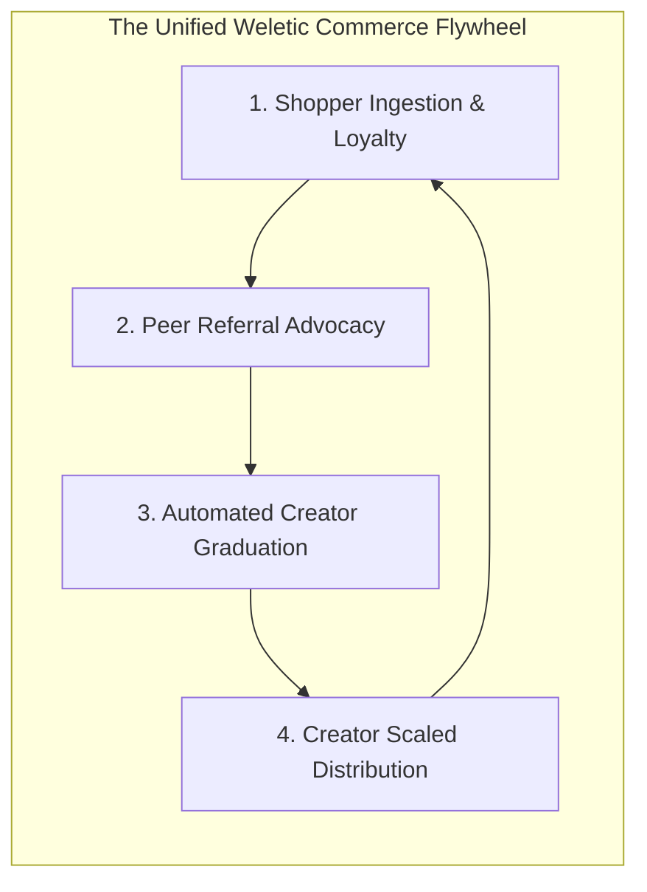
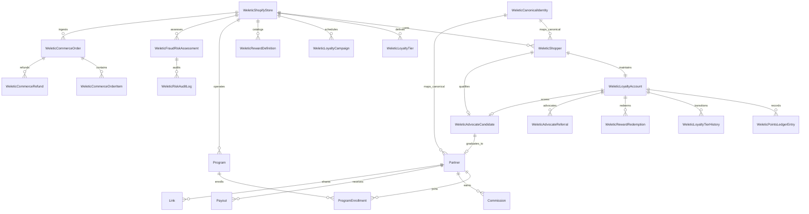
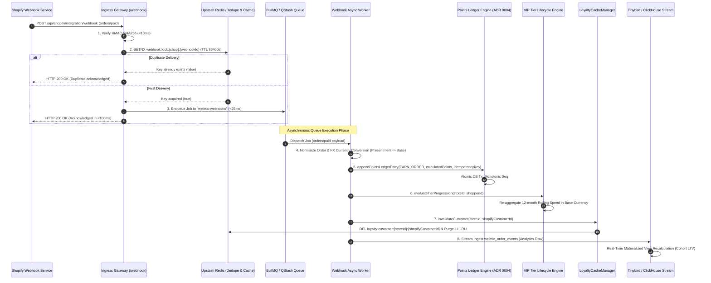
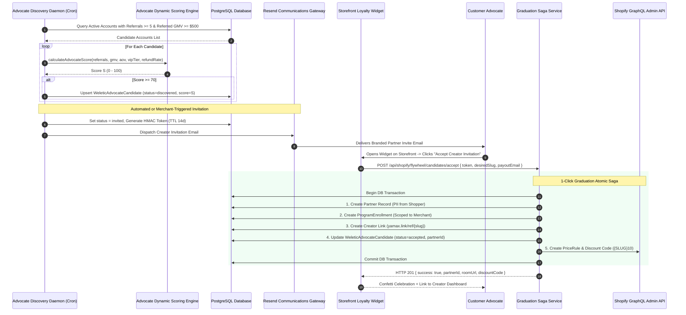
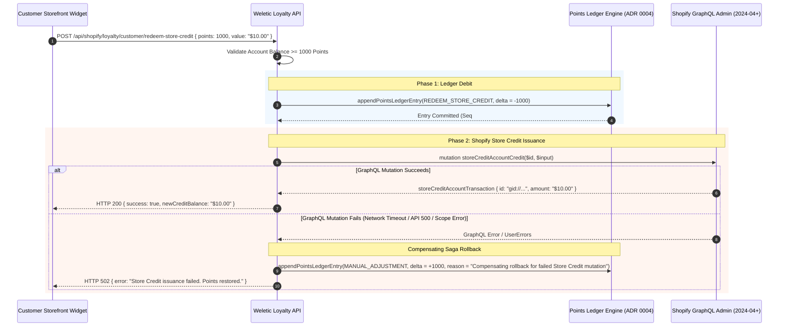

# Weletic Commerce Platform: Master Architecture Blueprint

**Document Version:** 1.0.0  
**Status:** Canonical Master Specification  
**Author:** Master Platform Architect & Roadmap Strategist (Worker 4)  
**Target Systems:** Weletic Commerce Platform (`apps/web`, `packages/weletic`, `packages/tinybird`, Storefront Extensions)  
**Related Specifications & ADRs:**

- `docs/architecture/LOYALTY_DEEPENING_SPECIFICATION.md` (R1: Feature Architecture)
- `docs/architecture/SCALABILITY_CACHING_INFRASTRUCTURE_SPEC.md` (R2: Infrastructure & Caching)
- `docs/architecture/FLYWHEEL_ANALYTICS_FRAUD_SHIELD_SPEC.md` (R3: Flywheel & Anomaly Shield)
- `docs/adrs/ADR-001-SHOPIFY-PLUS-CHECKOUT-UI-EXTENSION.md` (Checkout Extensibility & Dual-Track UX)
- `docs/adrs/ADR-002-DISTRIBUTED-QUEUE-BACKFILL-PIPELINE.md` (Distributed Queue & Backfill Pipeline)
- `docs/adrs/ADR-003-CROSS-NETWORK-FRAUD-ANOMALY-SHIELD.md` (Cross-Network Anti-Abuse Shield)
- Baseline Foundation ADRs: ADR 0003 (Bounded Context Isolation), ADR 0004 (Double-Entry Points Ledger), ADR 0005 (Two-Phase Backfill), ADR 0008 (Security Boundary)

---

## 1. Master Platform Vision & Architectural Governance

The **Weletic Commerce Platform** provides a unified, high-performance social commerce, creator affiliate attribution, and omnichannel customer loyalty engine built specifically for Shopify merchants operating in cross-border and multi-market environments.

The architecture solves the fundamental fragmentation in modern e-commerce where customer loyalty, creator affiliate programs, and customer referrals operate as disjointed point solutions. By unifying these domains within a mathematically rigorous, decoupled architecture, Weletic creates a **Growth Flywheel**:

1. Shoppers purchase and earn points via a double-entry ledger.
2. Shoppers become customer advocates, referring peers for mutual rewards.
3. Top advocates automatically graduate into official creator partners with dedicated branded storefronts ("Rooms" at `room.weletic.com/{slug}`), vanity shortlinks (`yamax.link/ref/{slug}`), and line-item fiat commissions.
4. Creators distribute their rooms to wider social audiences, driving new customer acquisition back into the top of the funnel.



### Core Architectural Mandates & System Invariants

1. **Strict Bounded Context Isolation (ADR-0003)**:
   Absolute model, database, and logic separation between Shoppers (`WeleticShopper`, `WeleticLoyaltyAccount`) and Partners (`Partner`, `ProgramEnrollment`, `Commission`). Shoppers never earn fiat cash commissions; Partners operate under monetary accounting. Crossover is mediated exclusively via explicit, non-destructive bridge entities (`WeleticAdvocateCandidate`).
2. **Double-Entry Append-Only Ledgering (ADR-0004)**:
   Every loyalty points mutation is recorded immutably in `WeleticPointsLedgerEntry` with monotonic atomic sequence numbers (`sequenceNumber`), exact integer/BigInt minor currency math, configurable holding periods, and deterministic proportional refund clawbacks with negative balance tolerance.
3. **Sub-150ms Webhook Acknowledgment with Resilient Queuing (ADR-002)**:
   Shopify webhooks (`orders/paid`, `refunds/create`) are cryptographically verified and enqueued asynchronously to a distributed queue (BullMQ / Upstash QStash) in <150ms, eliminating the catastrophic 5-second timeout and subscription deletion risk.
4. **2-Tier Read Caching & Edge Acceleration**:
   Storefront loyalty widget queries (`/api/shopify/loyalty/customer`) are accelerated via a 2-Tier cache hierarchy (In-Memory LRU + Global Upstash Redis), achieving sub-20ms p95 latency and offloading >99.6% of read queries from primary databases during flash sales.
5. **Dual-Track Checkout Extensibility (ADR-001)**:
   Native Shopify Plus Checkout UI Extension with a variable points slider backed by a 15-minute Redis reservation lock, paired with an automated 1-click cart drawer fallback for non-Plus Shopify plans.
6. **Zero-Trust Cross-Network Risk Shield (ADR-003)**:
   Continuous risk evaluation across canonical email hashing, Redis sliding-window IP velocity, same-IP checks, and cross-network self-referral detection, generating a normalized 0–100 risk score that quarantines or blocks abuse in real time.
7. **Multi-Market Rational FX Normalization**:
   Automated daily FX rate ingestion normalizing all multi-currency order spends into a single Base Program Currency (USD), fixing zero-decimal currency inflation (e.g. 100x points distortion on JPY and VND).

---

## 2. End-to-End Unified System Blueprint

```
┌──────────────────────────────────────────────────────────────────────────────────────────────────────────────────┐
│                               WELETIC COMMERCE MASTER TOPOLOGY                                                   │
└──────────────────────────────────────────────────────────────────────────────────────────────────────────────────┘

 [ Consumer Browser ]         [ Storefront Loyalty Widget ]       [ Shopify Plus Checkout UI ]       [ Social Click / Link ]
          │                                │                                    │                               │
          │                                │ GET /loyalty/customer              │ POST /checkout/reserve        │ GET yamax.link/ref/ALICE
          ▼                                ▼                                    ▼                               ▼
 ┌──────────────────────────────────────────────────────────────────────────────────────────────────────────────────┐
 │ LAYER 1: EDGE SURFACE & ROUTING LAYER (Cloudflare Global Anycast + Vercel Edge Runtime)                          │
 │                                                                                                                  │
 │  ┌──────────────────────────────────────────────┐       ┌────────────────────────────────────────────────────┐   │
 │  │ Tier 1: In-Memory LRU Micro-Cache (lru-cache)│       │ Edge Vanity Domain Router & SSL Gateway            │   │
 │  │ • Max 10,000 records per instance (TTL 60s)  │       │ • Resolve /:domain/ref/:code in Edge Redis (<10ms) │   │
 │  │ • Sub-millisecond latency (<1ms)             │       │ • Inject First-Party Attribution Cookie            │   │
 │  │ • SingleFlight request coalescing            │       │ • Async Click Stream Telemetry (Tinybird / Redis)  │   │
 │  └──────────────────────┬───────────────────────┘       │ • 302 Redirect to Canonical Storefront             │   │
 │                         │ (L1 Miss)                     └────────────────────────────────────────────────────┘   │
 │                         ▼                                                                                        │
 │  ┌──────────────────────────────────────────────┐                                                                │
 │  │ Tier 2: Upstash Redis Global (redisGlobal)   │                                                                │
 │  │ • Distributed Key-Value Store (TTL 3,600s)   │                                                                │
 │  │ • Multi-Region Read Replicas (15–35ms)       │                                                                │
 │  │ • Checkout Reservation Locks (TTL 900s)      │                                                                │
 │  │ • Sliding-Window IP Velocity Rate Limiter    │                                                                │
 │  └──────────────────────┬───────────────────────┘                                                                │
 └─────────────────────────┼────────────────────────────────────────────────────────────────────────────────────────┘
                           │ (L2 Miss)
                           ▼
 ┌──────────────────────────────────────────────────────────────────────────────────────────────────────────────────┐
 │ LAYER 2: API GATEWAY & FAST-PATH INGESTION (Next.js 14 App Router)                                               │
 │                                                                                                                  │
 │  ┌──────────────────────────────────────────────┐       ┌────────────────────────────────────────────────────┐   │
 │  │ Storefront & Admin API Gateway               │       │ Fast-Path Webhook Ingress Boundary (<150ms Ack)    │   │
 │  │ • App Proxy Session JWT Verification         │       │ • HMAC-SHA256 Cryptographic Verification (<10ms)   │   │
 │  │ • Merchant OAuth & Scope Enforcement         │       │ • Redis Deduplication Guard (TTL 24h)              │   │
 │  │ • Dynamic Rate Limiting & Query Coalescing   │       │ • Immediate Dispatch to Distributed Queue          │   │
 │  └──────────────────────┬───────────────────────┘       └─────────────────────────┬──────────────────────────┘   │
 └─────────────────────────┼─────────────────────────────────────────────────────────┼──────────────────────────────┘
                           │                                                         │
                           ▼                                                         ▼
 ┌──────────────────────────────────────────────────────────────────────────────────────────────────────────────────┐
 │ LAYER 3: DISTRIBUTED ASYNCHRONOUS PIPELINE (BullMQ / Upstash QStash)                                             │
 │                                                                                                                  │
 │  ┌───────────────────────────────────┐  ┌───────────────────────────────────┐  ┌───────────────────────────────┐ │
 │  │ Queue: weletic-webhooks           │  │ Queue: weletic-backfill          │  │ Queue: weletic-dlq (DLQ)       │ │
 │  │ • Concurrency: 10 Workers         │  │ • Chunk Size: 250 orders/batch   │  │ • 5-Attempt Exponential B/O   │ │
 │  │ • orders/paid, refunds/create     │  │ • Redis Cursor Checkpoint Resume │  │ • Admin 1-Click Replay Alert  │ │
 │  │ • Product Review Webhooks         │  │ • Leaky Bucket Shopify Throttler │  │ • Forensic Stack Trace Audit   │ │
 │  └─────────────────┬─────────────────┘  └─────────────────┬─────────────────┘  └───────────────────────────────┘ │
 └────────────────────┼──────────────────────────────────────┼──────────────────────────────────────────────────────┘
                      │                                      │
                      ▼                                      ▼
 ┌──────────────────────────────────────────────────────────────────────────────────────────────────────────────────┐
 │ LAYER 4: DECOUPLED CORE DOMAIN ENGINES (Bounded Contexts per ADR-0003)                                           │
 │                                                                                                                  │
 │  ┌────────────────────────────────────────────────────────────────────────────────────────────────────────────┐  │
 │  │ CONTEXT A: LOYALTY & SHOPPER DOMAIN                                                                        │  │
 │  │ • Double-Entry Points Ledger Engine (Monotonic Sequence, Atomic Commits, Proportional Refund Clawbacks)    │  │
 │  │ • VIP Tier Lifecycle & Retention Engine (Rolling 12m Spend, 30d Grace Period, Soft Step-Down Downgrades)   │  │
 │  │ • Non-Order Earning Engine (Birthday Sweeper, Review Adapters [Judge.me/Yotpo], Social Actions, Welcome)   │  │
 │  │ • Dynamic Multipliers Engine (Time-Windowed Campaigns, Segment Tags, Stacking Policies: Multiply/Add/Max)  │  │
 │  │ • Omnichannel Redemption Orchestrator (Checkout UI Slider Lock, 1-Click Vouchers, Store Credit Adapter)    │  │
 │  └────────────────────────────────────────────────────────────────────────────────────────────────────────────┘  │
 │                                                                                                                  │
 │  ┌────────────────────────────────────────────────────────────────────────────────────────────────────────────┐  │
 │  │ CONTEXT B: PARTNER & AFFILIATE DOMAIN                                                                      │  │
 │  │ • Creator Profile & Room Engine (Public Storefronts at room.weletic.com/{slug})                            │  │
 │  │ • Click Tracking & Attribution Engine (Dub Shortlink Router, First/Last-Touch Cookie Resolution)           │  │
 │  │ • Commission Engine (Line-Item Commission Rules, Minimum Payouts, Multi-Currency Fiat Settlement)          │  │
 │  │ • Payout Engine (PayPal / Stripe Connect / Wise Integration)                                               │  │
 │  └────────────────────────────────────────────────────────────────────────────────────────────────────────────┘  │
 │                                                                                                                  │
 │  ┌────────────────────────────────────────────────────────────────────────────────────────────────────────────┐  │
 │  │ CONTEXT C: THE FLYWHEEL BRIDGE & IDENTITY RESOLVER                                                         │  │
 │  │ • Advocate Discovery Daemon (Dynamic 0-100 Scoring based on Referral Count, Referred GMV, AOV & Tier)      │  │
 │  │ • Cryptographic Invitation Pipeline (HMAC-SHA256 Single-Use Tokens with 14-day TTL)                        │  │
 │  │ • 1-Click Partner Graduation Saga (Atomic Provisioning of Partner + Dub Link + Shopify Discount + Room)    │  │
 │  └────────────────────────────────────────────────────────────────────────────────────────────────────────────┘  │
 │                                                                                                                  │
 │  ┌────────────────────────────────────────────────────────────────────────────────────────────────────────────┐  │
 │  │ CONTEXT D: CROSS-NETWORK FRAUD & ANOMALY SHIELD (ADR-003)                                                  │  │
 │  │ • Canonical Email Normalization & SHA-256 Hashing (Gmail dot/plus stripping, Outlook, iCloud, Yahoo)       │  │
 │  │ • Sliding-Window IP Velocity Limiter (Atomic Redis Lua Script: max 3 binds/IP/24h)                         │  │
 │  │ • Cross-Network Self-Referral Correlator (Blocks Partner self-purchases & unearned dual-reward harvests)    │  │
 │  │ • Unified Risk Decision Engine (0-29: ALLOW, 30-69: FLAG_REVIEW Quarantine, 70-100: BLOCK)                 │  │
 │  └────────────────────────────────────────────────────────────────────────────────────────────────────────────┘  │
 └─────────────────────────────────────────────────────┬────────────────────────────────────────────────────────────┘
                                                       │
                                                       ▼
 ┌──────────────────────────────────────────────────────────────────────────────────────────────────────────────────┐
 │ LAYER 5: PERSISTENCE & ANALYTICAL STREAMING                                                                      │
 │                                                                                                                  │
 │  ┌──────────────────────────────────────────────┐       ┌────────────────────────────────────────────────────┐   │
 │  │ Primary Transactional Database (PostgreSQL)  │       │ Real-Time Analytical Engine (Tinybird / ClickHouse)│   │
 │  │ • Prisma ORM v6.19                           │       │ • Ingest: weletic_order_events, referral_clicks    │   │
 │  │ • Strict ACID Transactions & Row Locks       │       │ • Materialized Views: 30/60/90/180/365-day LTV     │   │
 │  │ • Explicit Foreign Keys & Cascades           │       │ • Blended CAC & Multi-Touch Attribution Curves     │   │
 │  └──────────────────────────────────────────────┘       └────────────────────────────────────────────────────┘   │
 └──────────────────────────────────────────────────────────────────────────────────────────────────────────────────┘
```

---

## 3. Decoupled Bounded Contexts & Schema Relationship Maps

In compliance with **ADR 0003**, the Weletic database schema enforces absolute isolation between the consumer loyalty graph and the creator partner graph.



### 3.1 Bounded Context Definitions & Invariant Contracts

| Context Name                       | Primary Entities                                                                                                                                 | Financial Currency                                 | Scope & Privacy Contract                                                                                                                        |
| ---------------------------------- | ------------------------------------------------------------------------------------------------------------------------------------------------ | -------------------------------------------------- | ----------------------------------------------------------------------------------------------------------------------------------------------- |
| **Context A: Shopper & Loyalty**   | `WeleticShopper`, `WeleticLoyaltyAccount`, `WeleticPointsLedgerEntry`, `WeleticLoyaltyTier`, `WeleticLoyaltyCampaign`, `WeleticRewardDefinition` | **Loyalty Points** (Integer / BigInt)              | Store-scoped. Shoppers exist strictly per merchant `storeId`. Points have no direct fiat cash liability outside the merchant's store.           |
| **Context B: Partner & Affiliate** | `Partner`, `Program`, `ProgramEnrollment`, `Commission`, `Payout`, `Link`, `Click`                                                               | **Fiat Money** (USD, JPY, EUR, VND in minor cents) | Global Creator Identity. Partners operate across programs, earn monetary commissions, and receive real money transfers.                         |
| **Context C: Flywheel Bridge**     | `WeleticAdvocateCandidate`                                                                                                                       | N/A (State Machine Bridge)                         | Referential Link Only. Stores discovery score, HMAC invitation token, and final `partnerId`. Never combines points and cash in one ledger.      |
| **Context D: Fraud Shield**        | `WeleticCanonicalIdentity`, `WeleticFraudRiskAssessment`, `WeleticRiskAuditLog`                                                                  | Risk Score (0–100)                                 | Zero-Knowledge Fingerprinting. Uses `canonicalEmailHash` (SHA-256) and Redis sliding windows to detect cross-network abuse without PII leakage. |
| **Context E: Commerce Ingestion**  | `WeleticCommerceOrder`, `WeleticCommerceOrderItem`, `WeleticCommerceRefund`, `WeleticDeadLetterJob`                                              | Presentment & Base Minor Units                     | Unconditional Ingestion. Ingests 100% of Shopify orders to provide ground truth for both loyalty and affiliate engines.                         |

---

## 4. Comprehensive Data Flow Sequences

### 4.1 Sequence 1: Order Placement $\rightarrow$ Fast-Path Webhook $\rightarrow$ Ledger $\rightarrow$ VIP $\rightarrow$ Invalidation $\rightarrow$ Analytics



---

### 4.2 Sequence 2: Shopify Plus Checkout UI Slider $\rightarrow$ 15-Min Redis Lock $\rightarrow$ Webhook Settlement

```mermaid
sequenceDiagram
    autonumber
    participant Shopper as Customer at Checkout
    participant SliderUI as Checkout UI Slider Extension (Plus)
    participant Gateway as Reservation Gateway (/checkout/reserve)
    participant RedisLock as Redis Upstash (Atomic Lua)
    participant ShopifyCheck as Shopify Checkout API
    participant WebhookWorker as Webhook Settlement Worker
    participant Ledger as Points Ledger Engine (ADR 0004)

    Shopper->>SliderUI: Adjusts Slider: 500 Points ($5.00 Off)
    SliderUI->>Gateway: POST /api/shopify/loyalty/checkout/reserve { customerId, points: 500, cartId }
    Gateway->>RedisLock: EVALSHA reserve_points.lua (storeId, customerId, points=500, ttl=900)

    alt Balance Insufficient or Locked
        RedisLock-->>Gateway: { success: false, reason: "INSUFFICIENT_AVAILABLE_BALANCE" }
        Gateway-->>SliderUI: HTTP 422 { error: "Insufficient available points" }
        SliderUI-->>Shopper: Displays Balance Warning Banner
    else Lock Acquired
        RedisLock-->>Gateway: { success: true, reservationId: "res_abc123", expiresAt: 1723910400 }
        Gateway->>ShopifyCheck: Generate Dynamic Single-Use Discount (WL-VAR-9988)
        ShopifyCheck-->>Gateway: Discount Code Created
        Gateway-->>SliderUI: HTTP 200 { reservationId, discountCode: "WL-VAR-9988", discountAmount: 5.00 }
        SliderUI->>ShopifyCheck: useApplyDiscountCodeChange("WL-VAR-9988")
        ShopifyCheck-->>Shopper: Cart Subtotal Reduced by $5.00
    end

    alt Checkout Finalized (orders/paid received within 15 min)
        ShopifyCheck->>WebhookWorker: orders/paid webhook (includes reservationId)
        WebhookWorker->>RedisLock: EVALSHA commit_reservation.lua (reservationId)
        RedisLock-->>WebhookWorker: Lock Released
        WebhookWorker->>Ledger: appendPointsLedgerEntry(REDEEM_REWARD, pointsDelta = -500)
        Note over Ledger: Immutable Ledger Debit Recorded; Seq Number Incremented
    else Checkout Abandoned / 15-Minute Timeout
        Note over RedisLock: Redis Key TTL (900s) Expires Automatically
        Note over RedisLock,Ledger: Zero Ledger Mutation; 500 Points Returned to Unlocked Balance
    end
```

---

### 4.3 Sequence 3: Advocate Discovery $\rightarrow$ Dynamic Scoring $\rightarrow$ 1-Click Creator Graduation



---

### 4.4 Sequence 4: Store Credit Redemption Saga with Compensating Rollback



---

## 5. Cross-Cutting Engineering Standards & Invariants

### 5.1 Currency Math & Numeric Precision Invariant

- **No Floating Point Storage**: All monetary values are stored as `BigInt` minor currency units (e.g. `$10.50` stored as `1050`, `¥1,000` stored as `1000`).
- **Zero-Decimal Handling**: Currencies identified by `isZeroDecimalCurrency(code)` (`JPY`, `VND`, `KRW`, `CLP`) are treated as 1:1 major-to-minor units.
- **FX Cross-Rate Conversions**: Cross-rates are derived using 12-decimal rational arithmetic (`rateToUsd / rateFromUsd`) before applying integer floor operations.

### 5.2 Deterministic Idempotency Key Formats

All state-mutating operations require deterministic idempotency keys to guarantee at-most-once execution:

| Operation Type              | Deterministic Idempotency Key Pattern                            |
| --------------------------- | ---------------------------------------------------------------- |
| **Order Points Earning**    | `order-earn:{storeId}:{orderId}:{accountId}`                     |
| **Partial Refund Clawback** | `refund-clawback:{storeId}:{refundId}:{accountId}`               |
| **Birthday Reward**         | `birthday:{storeId}:{accountId}:{YYYY}`                          |
| **Product Review Reward**   | `review:{provider}:{storeId}:{reviewId}`                         |
| **Social Action Reward**    | `social:{storeId}:{accountId}:{actionType}`                      |
| **Welcome Bonus**           | `welcome:{storeId}:{accountId}`                                  |
| **15-Min Checkout Lock**    | `res_{uuidv4()}` stored in `loyalty:lock:{storeId}:{customerId}` |
| **Webhook Delivery Dedupe** | `webhook:lock:{shopDomain}:{webhookId}`                          |

### 5.3 GDPR & Privacy Compliance Standards

In compliance with Shopify Partner Requirements and GDPR/CCPA regulations:

- **Mandatory Webhook Handlers**: `customers/data_request`, `customers/redact`, `shop/redact`.
- **Data Export**: `customers/data_request` exports complete shopper profiles, current VIP tier, active referral codes, and full ledger history.
- **Data Redaction**: `customers/redact` scrubs customer PII (`firstName`, `lastName`, `email`, `phone`, `shippingAddress`) from `WeleticShopper` while preserving anonymized `WeleticPointsLedgerEntry` rows with `shopperId = REDACTED` to maintain financial double-entry integrity.
- **Store Redaction**: `shop/redact` deletes all store configurations, cache keys, and historical backfill jobs 48 hours after app uninstall.

---

_Master Architectural Blueprint authored and certified by Worker 4 (Master Platform Architect & Roadmap Strategist)._
